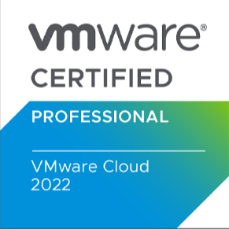

Salve Salve Pessoal!

Recentemente a VMware anunciou sua nova certificação, a **VMware Certified Professional – VMware Cloud (VCP–VMC) 2022**.

Essa certificação valida a capacidade de identificar os principais componentes de uma solução VMware em Cloud, como se conectar e migrar para VMware Cloud, os benefícios do VMware Tanzu Kubernetes Grid.

É necessário demonstrar um bom entendimento em armazenamento, redes, segurança, continuidade de negócios, recuperação de desastres, monitorar e solucionar problemas em um ambiente VMware Cloud.

O melhor de tudo é que a VMware está dando o curso e o exame de graça, pelo menos por enquanto.

Então corre e garante a sua, que essa oferta é por tempo limitado.

Todos os detalhes de como se inscrever e os assuntos cobrados no exame podem ser encontrados nos links abaixo:

[https://blogs.vmware.com/learning/2022/12/09/introducing-the-new-vmware-cloud-certification-and-a-special-offer/](https://blogs.vmware.com/learning/2022/12/09/introducing-the-new-vmware-cloud-certification-and-a-special-offer/)

[https://www.vmware.com/learning/certification/vcp-vmc.html](https://www.vmware.com/learning/certification/vcp-vmc.html)

Boa sorte!

Até o próximo post!

:D
