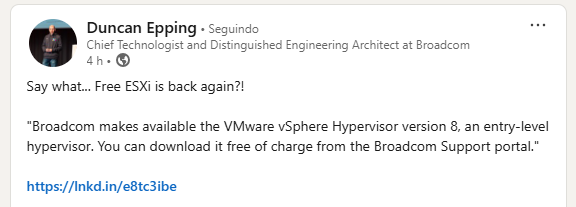
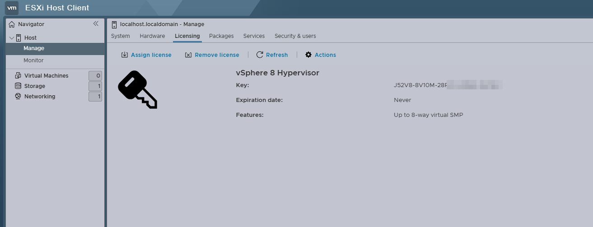

Salve Salve Pessoal!

Hoje, navegando pelo LinkedIn, me deparei com uma postagem interessante de Duncan Epping, renomado engenheiro da VMware, que atualmente faz parte da Broadcom. Na publicação, ele menciona a volta da versão gratuita do ESXi, algo que muitos profissionais de TI vinham aguardando ansiosamente desde as recentes mudanças na estratégia de licenciamento.

[https://www.linkedin.com/feed/update/urn:li:activity:7316375643976261632/](https://www.linkedin.com/feed/update/urn:li:activity:7316375643976261632/)

Fui conferir o link que ele compartilhou e, para minha grata surpresa, a informação se confirmou: a Broadcom está realmente disponibilizando novamente a versão gratuita do ESXi.

Apesar da ausência de um anúncio oficial, a Broadcom voltou a disponibilizar o ESXi Free, e essa é, sem dúvida, uma excelente notícia para a comunidade.

Já realizei o download e fiz a instalação para validar a informação. Como é possível ver na imagem abaixo, a ISO já vem com a licença configurada por padrão.

**Link para download:** [https://support.broadcom.com/group/ecx/free-downloads](https://support.broadcom.com/group/ecx/free-downloads)

Particularmente, fiquei muito feliz com essa decisão da Broadcom e torço para que ela seja mantida no futuro, sem novas mudanças inesperadas.

Até a próxima!

:D
