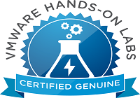

Salve Salve Pessoal!

Uma dica para quem está estudando para certificação da VMware é o site VMware HOL Online. Nele é possível realizar vários labs fornecidos e pre-configurados pela própria VMware, é muito bom para que está estudando sobre os recursos e não tem um  bom hardware disponível para realizar esses laboratórios. Sem contar que existem labs que você não consegue realizar pelo fato de não haver produto trial disponível.

 Segue abaixo um vídeo explicando o funcionamento:

<iframe src="//www.youtube.com/embed/OxWt6qY3td8" width="560" height="315" frameborder="0" allowfullscreen="allowfullscreen"></iframe>

Link para o site:

[http://labs.hol.vmware.com/](http://labs.hol.vmware.com/)
