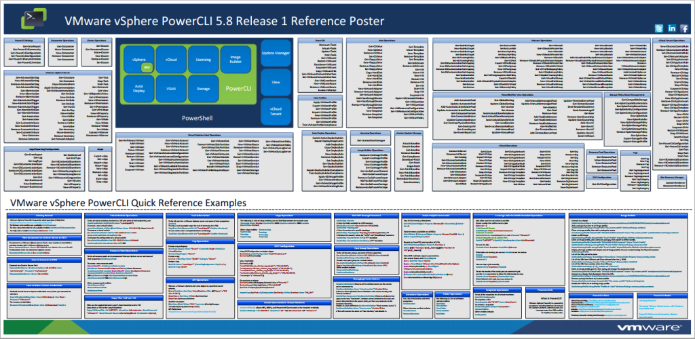

Salve Salve Pessoal!

Segue abaixo um poster com comandos do PowerCLI, muito bom para quem deseja aprender um pouco mais sobre VMware (EU)!

Até a próxima :D<!--more-->

                                        Click [AQUI](http://blogs.vmware.com/PowerCLI/files/2014/10/PowerCLI58r1.pdf) para fazer o download!

