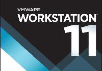
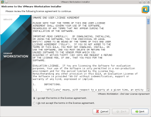
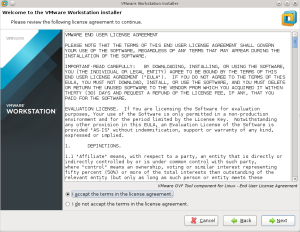
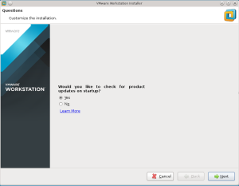
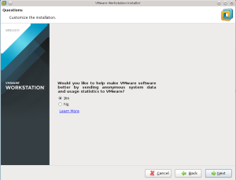
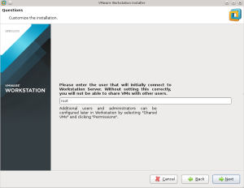
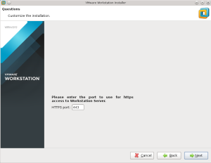
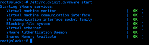

[](http://rodrigolira.eti.br/wp-content/uploads/2015/06/vmw-bnr-workstation11-product1.jpg)Salve Salve Pessoal!

Resolvi fazer uma serie de posts para mostrar as funcionalidades do VMware Workstation, o mesmo é muito pouco explorado, principalmente quando se trata de realizar alguns laboratórios com a ferramenta, sem contar diversos outros recursos que não são utilizados.

Neste primeiro post vou mostrar como instalar ele no Linux, no meu caso no Slackware, a instalação segue o mesmo padrão em outras distribuições, como também no windows.

Então vamos lá:

Primeiro baixe o VMware Workstation do site da vmware:

[https://my.vmware.com/web/vmware/info/slug/desktop\_end\_user\_computing/vmware\_workstation/11\_0](https://my.vmware.com/web/vmware/info/slug/desktop_end_user_computing/vmware_workstation/11_0)

Dê permissão de execução ao arquivo:

```
#chmod +x VMware-Workstation-Full-11.1.0-2496824.x86_64.bundle
```

<!--more-->E execute o mesmo:

```
#./VMware-Workstation-Full-11.1.0-2496824.x86_64.bundle -I
```

**Obs:** Foi utilizado o parâmetro "-I" no final do comando para ignorar erros, para verificar todas as opções possíveis basta coloca o parâmetro "--help".

Apôs executar o comando a janela de instalaçao do VMware Workstation se abre:

1 - Aceite a licença de uso da ferramenta:

[](http://rodrigolira.eti.br/wp-content/uploads/2015/06/imagem2.png)

 

 

 

 

 

 

2 - Aceite a licença de uso de componente OVF Tool para Linux.

[](http://rodrigolira.eti.br/wp-content/uploads/2015/06/imagem3.png)

 

 

 

 

 

 

3 - Marque "yes" para verificação de atualização quando iniciar a ferramenta:

[](http://rodrigolira.eti.br/wp-content/uploads/2015/06/imagem4.png)

 

 

 

 

 

 

4 - Se deseja ajudar com o desenvolvimento da ferramenta, marque "yes" para enviar estatísticas sobre a ferramenta:

[](http://rodrigolira.eti.br/wp-content/uploads/2015/06/imagem5.png)

 

 

 

 

 

 

5 - Deixe como padrão "root":

[](http://rodrigolira.eti.br/wp-content/uploads/2015/06/imagem6.png)

 

 

 

 

 

 

6 - Deixe o compartilhamento de VMs como padrão da instalação:

[](http://rodrigolira.eti.br/wp-content/uploads/2015/06/imagem7.png)

 

 

 

 

 

 

7 - Deixe a porta padrão de acesso "443":

[](http://rodrigolira.eti.br/wp-content/uploads/2015/06/imagem8.png)

 

 

 

 

 

 

8 - Adicione a cheve de licença de uso, caso não tenha pressione "next", você poderá usar a ferramenta durante 30 dias:

[](http://rodrigolira.eti.br/wp-content/uploads/2015/06/imagem9.png)

 

 

 

 

 

 

9 - Clique em "install" para instalar a ferramenta:

[](http://rodrigolira.eti.br/wp-content/uploads/2015/06/imagem10.png)

 

 

 

 

 

 

10 - Pronto, VMware Workstation instalado:

[](http://rodrigolira.eti.br/wp-content/uploads/2015/06/imagem11.png)

 

 

 

 

 

 

No Slackware você precisar iniciar o serviço do VMware Workstation manualmente, execute o seguinte comando:

#/etc/rc.d/init.d/vmware start

[](http://rodrigolira.eti.br/wp-content/uploads/2015/06/imagem12.png)

 

 

 

Para automatizar esse processo na inicialização do sistema, adicione no as seguintes linhas no /etc/rc.d/rc.local:

```
if [ -x etc/rc.d/init.d/vmware ] 
then 
/etc/rc.d/init.d/vmware start 
fi
```

Pronto, VMware Workstation 11 instalado!

Até a próxima :D
