Salve Salve Pessoal!

No VMware Workstation temos a possibilidade de criar um compartilhamento de pastas entre a maquina física e a maquina virtual.

Isso é muito simples de fazer quando a máquina física é um Windows (server/desktop) e a máquina virtual também é Windows (server/desktop).

Porém, quando a máquina virtual é um Linux, é um pouco mais complicado, principalmente se a maquina virtual não estiver com uma interface gráfica.

No meu cenário, a maquina física é um Windows 10 e a maquina virtual é um Red Hat 7.

 

[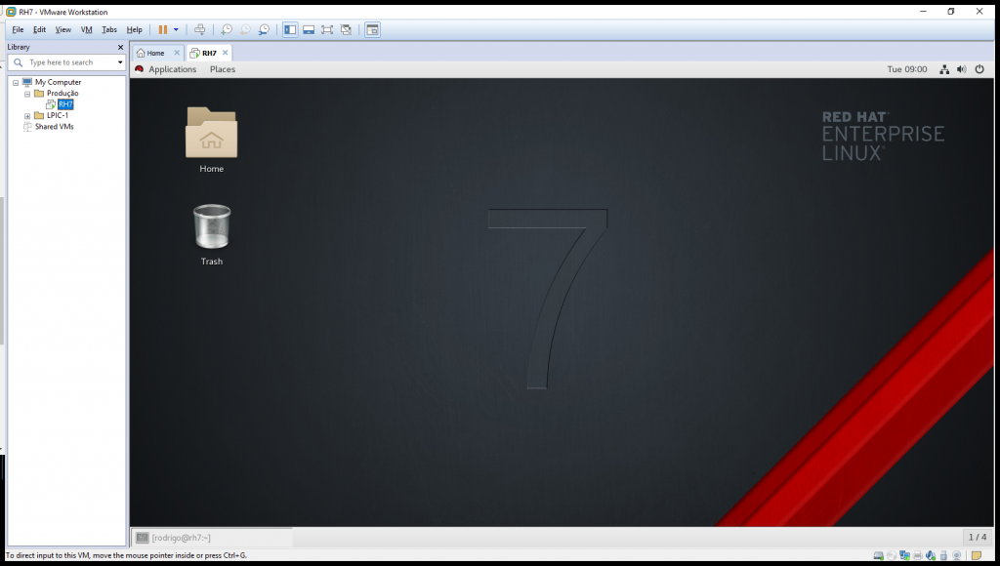](http://rodrigolira.eti.br/wp-content/uploads/2017/10/RH7-VMware-Workstation-2017-10-17-09.00.49.png)

 

Então vamos ver como isso pode ser feito :D

Em uma instalação padrão do Red Hat 7, o pacote open-vm-tools já vem instalado por padrão, verifique se o mesmo está em execução com o comando abaixo:

```
# systemctl status vmtoolsd
```

 

[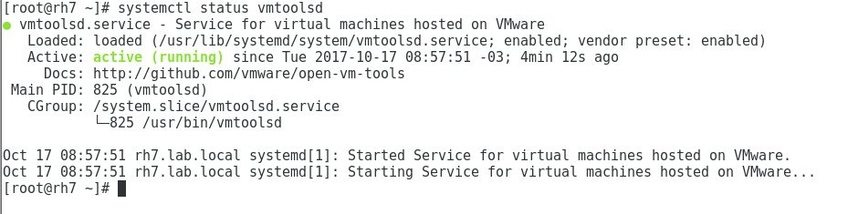](http://rodrigolira.eti.br/wp-content/uploads/2017/10/RH7-VMware-Workstation-2017-10-17-09.03.47.png)

 

Caso o mesmo não esteja em execução, verifique se o mesmo está instalado com o comando abaixo:

```
# rpm -qa | grep open-vm-tools
```

 

[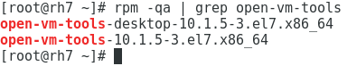](http://rodrigolira.eti.br/wp-content/uploads/2017/10/RH7-VMware-Workstation-2017-10-17-09.06.53.png)

 

Apenas para explicar, o open-vm-tools-desktop é quando utilizamos interface gráfica.

Caso não esteja instalado, execute os seguintes comandos:

```
# yum install -y open-vm-tools (Instala o pacote)

# systemctl start vmtoolsd (Inicia o serviço)

# systemctl enable vmtoolsd (Habilita a inicialização automática)
```

Agora que confirmamos ou instalamos o open-vm-tools, vamos ao que interessa.

Selecione a VM, clique com o botão direito do mouse e depois clique em **Settings**.

 

[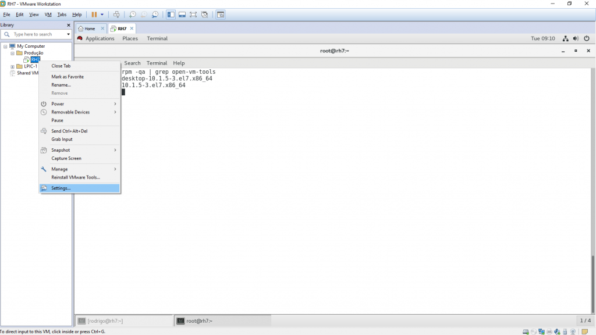](http://rodrigolira.eti.br/wp-content/uploads/2017/10/desktop.png)

 

Selecione a aba **Options** e depois clique em **Shared Folders**.

Por padrão o compartilhamento vem como desabilitado, podemos escolher para deixar sempre habilitado, ou até a próxima vez que desligar ou suspender a vm, no nosso caso vamos deixar sempre habilitado.

Então selecione **Always enabled** e clique em **Add** para adicionarmos a pasta que desejamos compartilhar.

 

[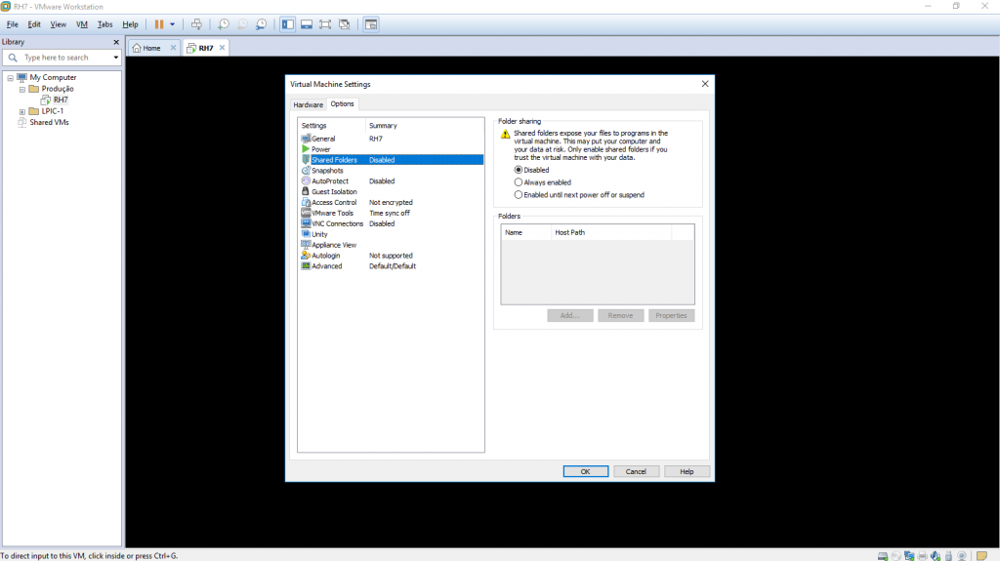](http://rodrigolira.eti.br/wp-content/uploads/2017/10/Virtual-Machine-Settings-2017-10-17-09.13.41.png)

 

Se abrirá uma nova aba de configuração, clique em **Next**.

 

[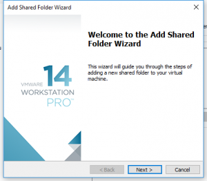](http://rodrigolira.eti.br/wp-content/uploads/2017/10/Add-Shared-Folder-Wizard-2017-10-17-09.23.13.png)

 

Clique em **Browse** e selecione a pasta que deseja compartilhar.

 

[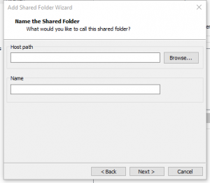](http://rodrigolira.eti.br/wp-content/uploads/2017/10/Add-Shared-Folder-Wizard-2017-10-17-09.27.23.png)

 

No meu caso, tenho um segundo disco no notebook, chamado Dados, vamos compartilhar ele, selecione o disco ou a pasta e clique em **OK**.

 

[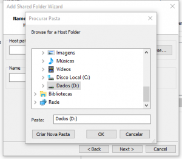](http://rodrigolira.eti.br/wp-content/uploads/2017/10/Add-Shared-Folder-Wizard-2017-10-17-09.26.29.png)

 

Digite um nome para o compartilhamento, no meu caso vou deixar com o nome **Dados** mesmo, e clique em **Next**.

 

[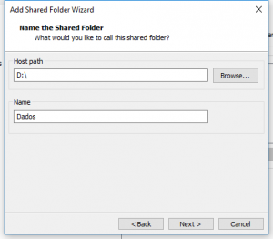](http://rodrigolira.eti.br/wp-content/uploads/2017/10/Add-Shared-Folder-Wizard-2017-10-17-09.30.07.png)

 

Caso deseje que esse compartilhamento seja apenas leitura, marque a caixa Read-only, no meu caso vou deixar no padrão, clique em **Finish** e depois em **OK**.

 

[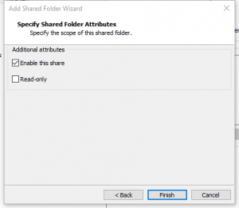](http://rodrigolira.eti.br/wp-content/uploads/2017/10/Add-Shared-Folder-Wizard-2017-10-17-09.31.47.png)

 

Pronto, a configuração no VMware Workstation terminou, agora vamos para nossa vm linux.

Acesse a vm e abra o terminal, a primeira coisa que precisamos fazer é criar uma pasta onde desejamos montar a pasta compartilhada do windows, no meu caso vou criar uma pasta chamada **dados** no **/**.

Execute o seguinte comando para criar a pasta /dados:

```
# mkdir /dados
```

Agora execute o comando abaixo para montar a pasta Dados(windows) em /dados(Linux):

```
# vmhgfs-fuse .host:/Dados /dados
```

 

[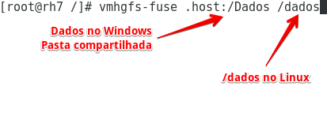](http://rodrigolira.eti.br/wp-content/uploads/2017/10/RH7-VMware-Workstation-2017-10-17-09.43.22.png)

Pronto, pode acessar a pasta **/dados** que todos os arquivos do host físico windows estarão disponíveis também no linux.

Mas Rodrigo, quando eu reiniciar a vm, essa pasta estará disponível?

Sim, o compartilhamento sempre estará disponível, porém você precisará executar o comando de montagem novamente.

Para que isso fique de forma automática, precisamos colocar no **/etc/fstab**.

Insira a seguinte linha no **/etc/fstab**

```
.host:/Dados       /dados       fuse.vmhgfs-fuse       defaults       0 0
```

 

[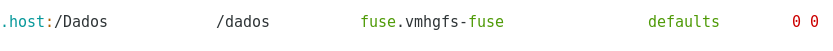](http://rodrigolira.eti.br/wp-content/uploads/2017/10/RH7-VMware-Workstation-2017-10-17-09.54.32.png)

 

Salve o arquivo e execute o comando abaixo:

```
# mount -a
```

Pronto, agora todas as vezes que você reiniciar a vm o compartilhamento estará disponível.

Até a próxima :D
