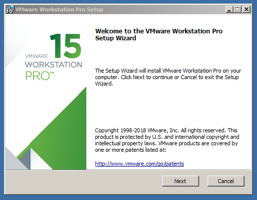
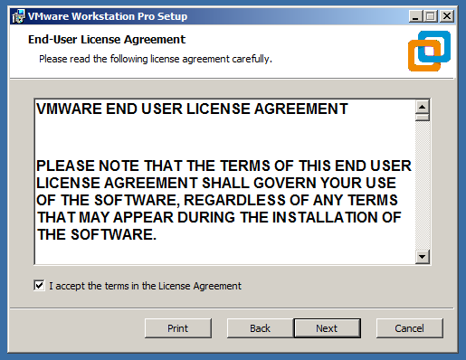
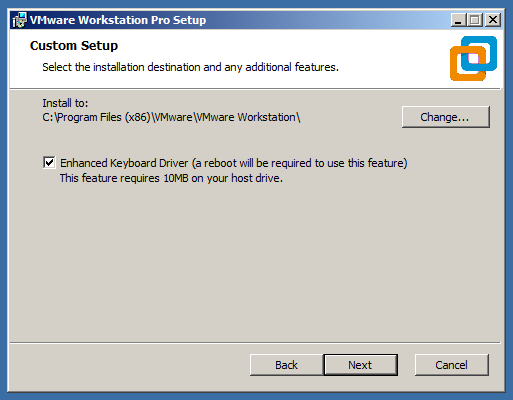
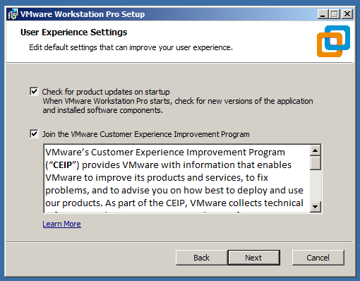
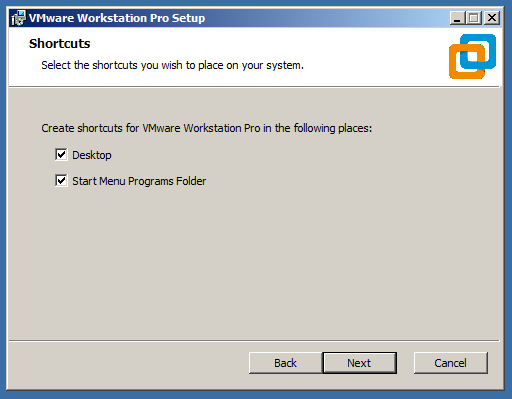
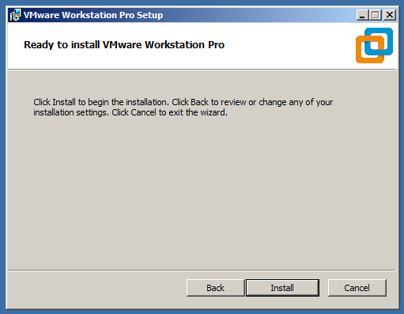
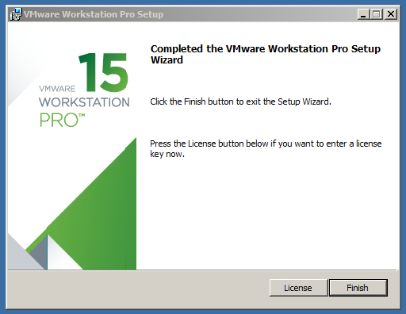
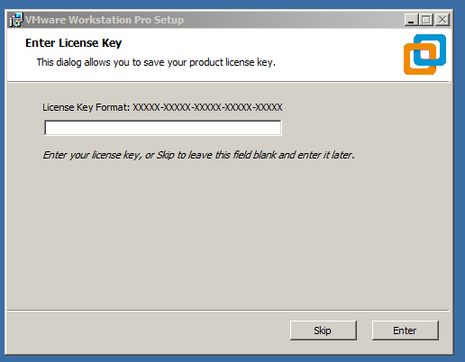
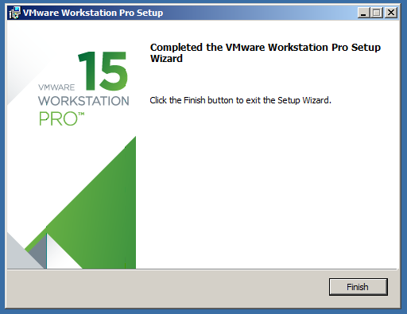

Salve Salve Pessoal!

Faz algum tempo que venho querendo falar um pouco sobre o VMware Workstation Pro.

Apesar do mesmo ser uma ferramenta voltada para desktop, o mesmo possui várias funcionalidades que são pouco exploradas entre seus usuários, como por exemplo a possibilidade de criptografar o disco, acesso remoto, execução de scripts, gerenciamento via console e etc.

Para começar, vamos partir do básico, da instalação.

Acesse o site da VMware e faça o download, a versão atual é a versão 15.0.2, ela foi lançada no dia 22/11/2018, se tiver interesse podemos ler o release notes no link abaixo:

[https://docs.vmware.com/en/VMware-Workstation-Pro/15/rn/workstation-1502-release-notes.html](https://docs.vmware.com/en/VMware-Workstation-Pro/15/rn/workstation-1502-release-notes.html)

Após realizar o download execute o programa de instalação.

**01** - Clique em **Next**.

**02** - **Aceite os Termos** e clique em **Next**.

**03** - Selecione o **Enhanced Keyboard Driver** e clique em **Next**.

O  **Enhanced Keyboard Driver** oferece um melhor controle de teclados internacionais que possuem teclas extras. Esse recurso está disponível apenas para sistemas Windows.

**04** - Se deseja checar atualizações e participar do programa de experiência da VMware, selecione as opções e clique em **Next**.

**05** - Selecione para criar os ícones e clique em **Next**.

**06** - Clique em **Install**.

**07** - Clique em **License** e insira a sua licença, caso não possua licença, clique em **Finish**.

**08** - Insira a sua licença e clique em **Enter**.

**OBS:** Se você não possui a licença do VMware Workstation Pro, você pode usar o mesmo por um período de teste durante trinta dias.

O pessoal do **vBrownBag Brasil** estão sempre sorteando licenças e brindes nos canais deles, sigam eles nos links abaixo:

**Twitter** - [https://twitter.com/vBrownBagBrasil](https://twitter.com/vBrownBagBrasil)

**Facebook** - [https://www.facebook.com/vBrownBagBrasil](https://www.facebook.com/vBrownBagBrasil/)

**Youtube** - [https://www.youtube.com/channel/UCz2gHFMZpObLxixcYxLC9LA](https://www.youtube.com/channel/UCz2gHFMZpObLxixcYxLC9LA)

**09** - Instalação realizada com sucesso, basta clicar em **Finish**.

Pode ser solicitado a reinicialização do sistema operacional, caso seja solicitado reinicie o sistema.

Até a próxima!

:D
