

Salve Salve Pessoa!

No primeiro post dessa serie, vimos como podemos fazer a instalação do **VMware Workstation Pro 15** no Windows, agora que já instalamos, vamos ver como criar uma máquina virtual e todas as configurações que precisamos realizar.

Para ver o primeiro post clique [AQUI](https://rodrigolira.eti.br/vmware-workstation-pro-15-parte-01-instalacao/).

Nos podemos criar uma nova máquina virtual de três formas:

- Criar uma nova máquina virtual do zero.
- Clonar uma máquina virtual existente no ambiente.
- Importar um OVF (OpenVirtualization Format).

Em outros posts vamos falar como clonar uma máquina virtual e como importar um OVF, nesse posts vamos apenas criar uma máquina virtual do zero.

Vamos ao que interessa :D

**1** - Para criar uma nova máquina virtual, clique no ícone **Create a New Virtual Machine**.

[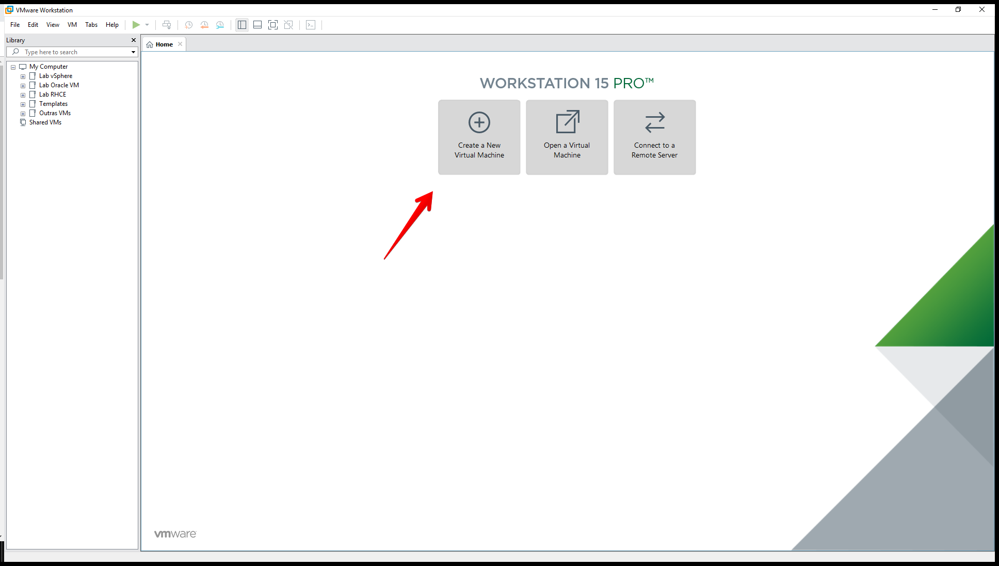](images/01-1.png)**2** - A tela de **Wizard** será aberta, temos duas formas de configurar essa nossa nova máquina virtual, o modo típico que é o recomendado, e o customizado que é a forma avançada, como queremos entender todos os parâmetros possíveis, vamos seleciona a forma **customizada/avançada**, e clique em **Next**.

[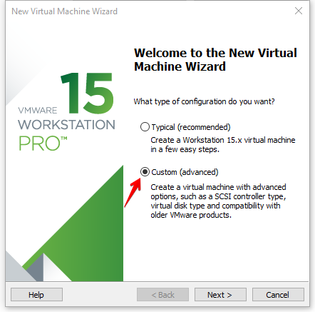](images/02-1.png)

**3** - Escolha a versão de compatibilidade de hardware da sua máquina virtual, selecione **Workstation 15.x** e clique em **Next**.

[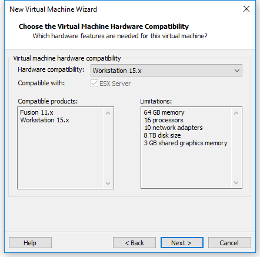](images/03-1.png)O hardware virtual, define quais features são suportadas pela sua máquina virtual, exemplo, suporte a BIOS ou UEFI, quantidade de memoria, quantidade de processadores e etc.

**4** - Selecione o método de instalação, se vamos utilizar a unidade de cd/dvd da máquina física, um arquivo .iso ou se desejamos deixar em branco e configurar posteriormente, escolha **Installer disc image file (iso)** e escolha a iso do sistema operacional, depois clique em **Next**.

[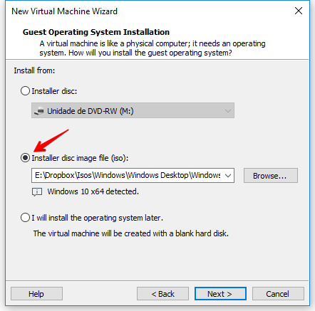](images/04-1.png)**5** - Digite o **nome** da máquina virtual, e escolha a **localização**, no momento vamos deixar no padrão, veremos como mudar em algum outro post, clique em **Next**.

[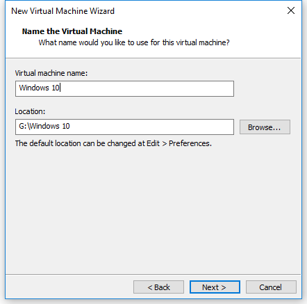](images/05-1.png)A localização padrão do diretório das máquinas virtuais é o seguinte:

**Windows** - C:\\Users\\**USUARIO**\\Documents\\Virtual Machines

**Linux** - /home/**USUARIO**/vmware

**OBS:** **USUARIO** é o seu usuário do sistema operacional.

**6** - Selecione o tipo de **Firmware** e clique em **Next**.

[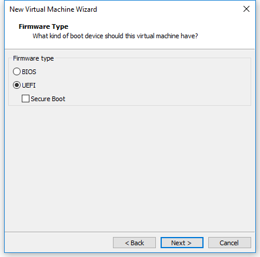](images/06-1.png)**7** - Selecione a quantidade de **processadores** e a quantidade de **cores** cada processador vai possuir e clique em **Next**.

[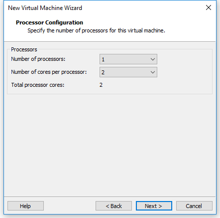](images/07-1.png)

**8** - Selecione o tamanho da **memoria** da máquina virtual e clique em **Next**.

[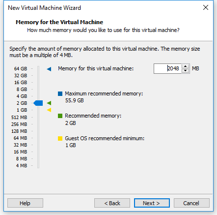](images/08-1.png)**9** - Selecione o tipo de rede, neste momento vamos usar a rede de tipo **NAT**, em outro post vamos falar exclusivamente de redes, clique em **Next**.

[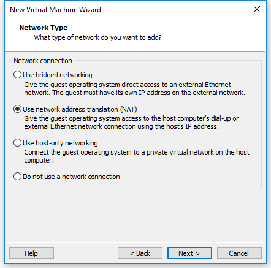](images/09-1.png)

**10** - Selecione o tipo de controladora **ISCSI**, nesse caso só está disponível **LSI Logic SAS**, mas isso pode variar de acordo com seu sistema operacional, normalmente devemos usar o que é recomendado, clique em **Next**.

[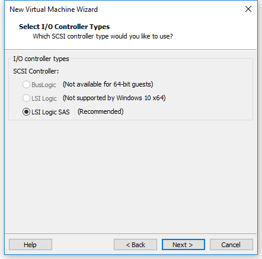](images/10.png)**11** - Selecione o tipo de disco e clique em **Next**.

[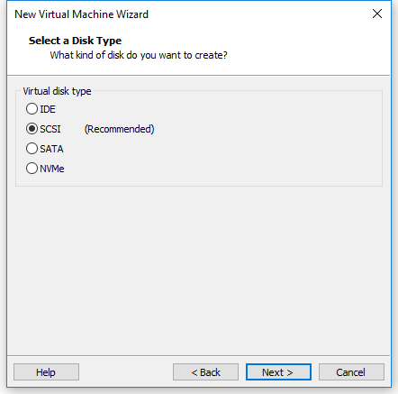](images/11.png)

**12** - Selecione um disco, podemos criar um novo disco, usar o disco já existente ou podemos usar um disco físico dedicado, nesse momento vamos criar um novo disco **Create a new virtual disk**, veremos as outras opões em outro post, clique em **Next**.

[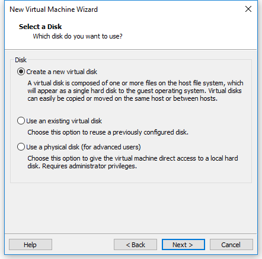](images/12.png)**13** - Defina o tamanho do disco e clique em **Next**.

[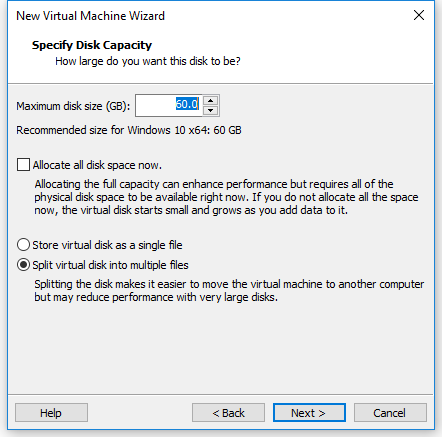](images/13.png)Após definir o tamanho do disco, temos três formas de uso do mesmo.

**Allocate all disk space now** - Nesse modo o disco virtual da máquina virtual, já aloca todo espaço físico em seu disco físico, ou seja, se tenho um disco físico com 120GB de espaço livre e crio uma máquina virtual com 60GB de disco virtual, meu disco físico passa a possuir apenas 60GB de espaço livre.

**Store virtual disk as a single file** - O disco virtual da máquina virtual cresce de acordo com a necessidade, porém tudo alocado em um único arquivo.

**Store virtual disk as a multiple file** - O disco virtual da máquina virtual cresce de acordo com a necessidade, porém alocado em diversos arquivos diferentes.

**14** - Podemos mudar a localização do nosso arquivo de disco virtual, deixe no padrão e clique em **Next**.

[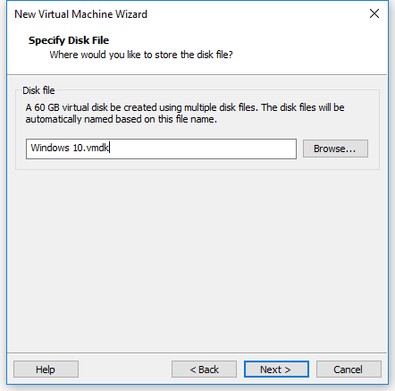](images/14.png)

**15** - Finalizamos a configuração do hardware virtual de nossa máquina virtual, podemos customizar o hardware dessa máquina virtual, adicionando mais discos virtuais, dispositivos usb, placas de rede e etc, porém veremos isso em outro post, selecione **Power on this is virtual machine after creation** se deseja iniciar essa máquina virtual após clicar em **Finish**.

[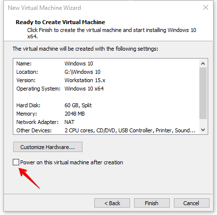](images/15.png)**16** - Depois da máquina virtual criada, basta ligar ela, para isso clique em **Power on this is virtual machine****.**

[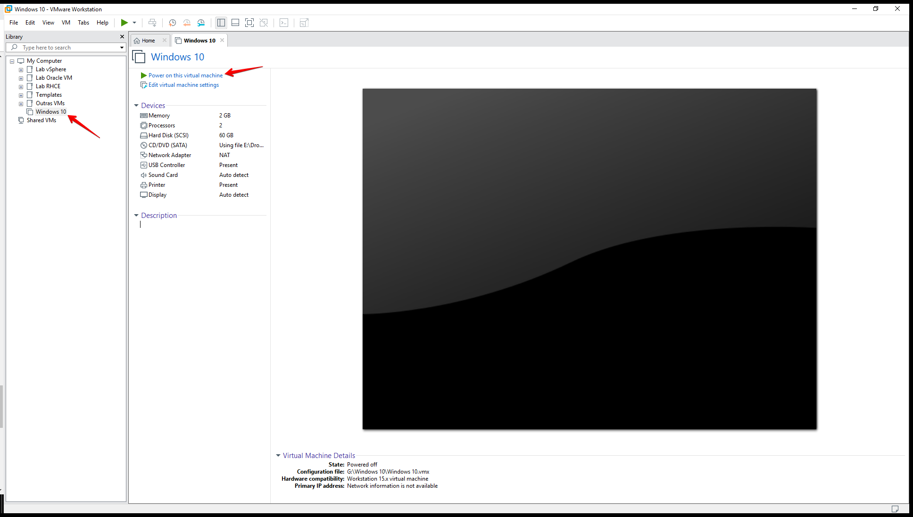](images/16.png)

**17** - Instale o sistema operacional normalmente como se fosse em um máquina física.

[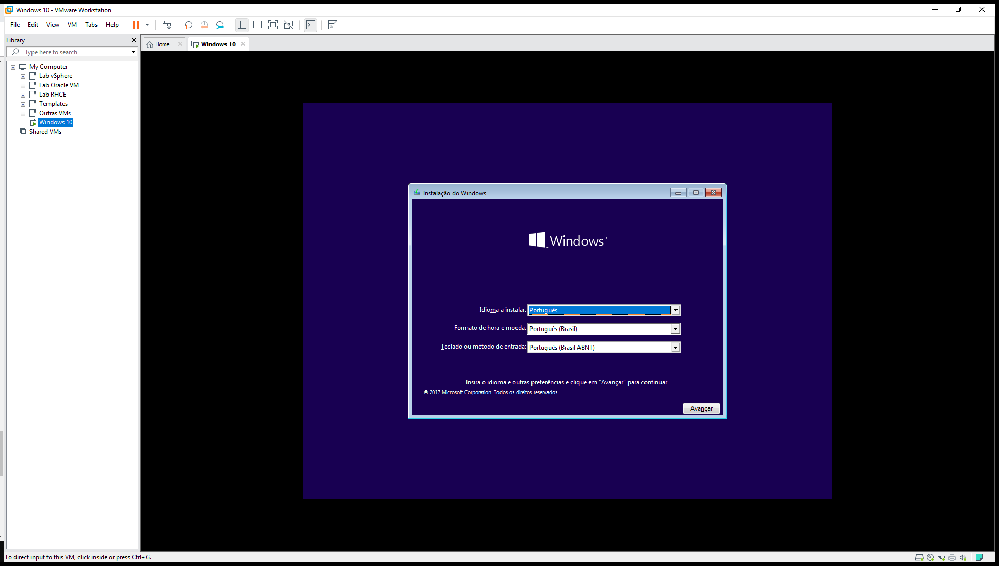](images/17.png)Pronto, nossa máquina virtual foi criada!

No próximo post dessa serie vamos conhecer e instalar o **VMware Tools** e **Open VMware Tools**.

Até a próxima!

:D
