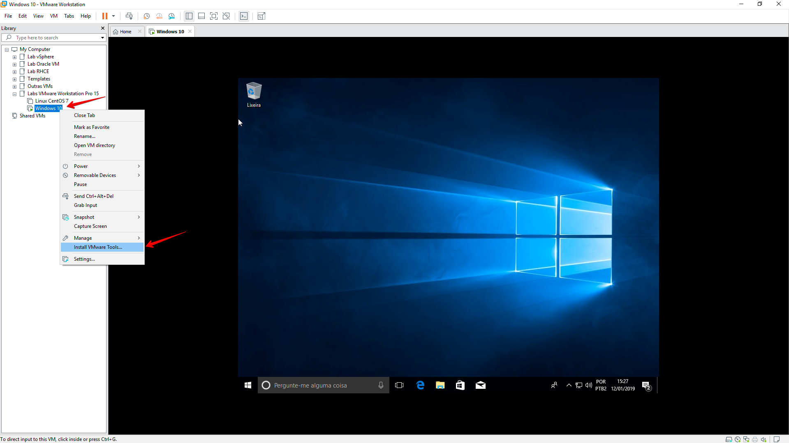
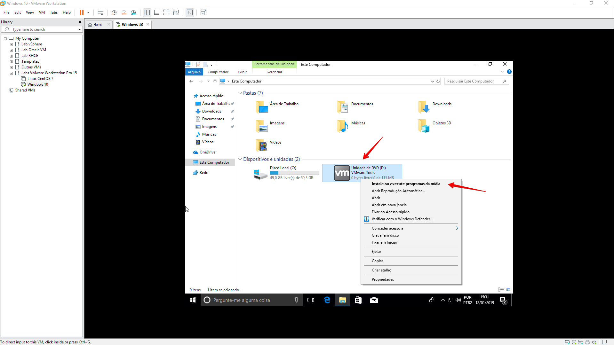
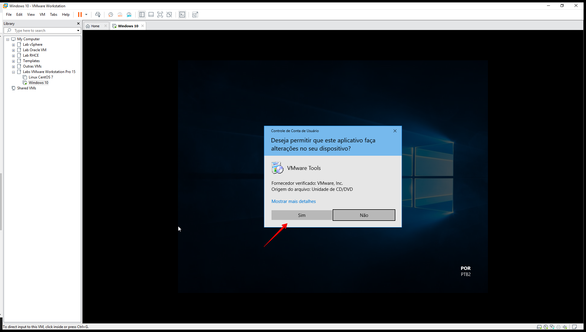
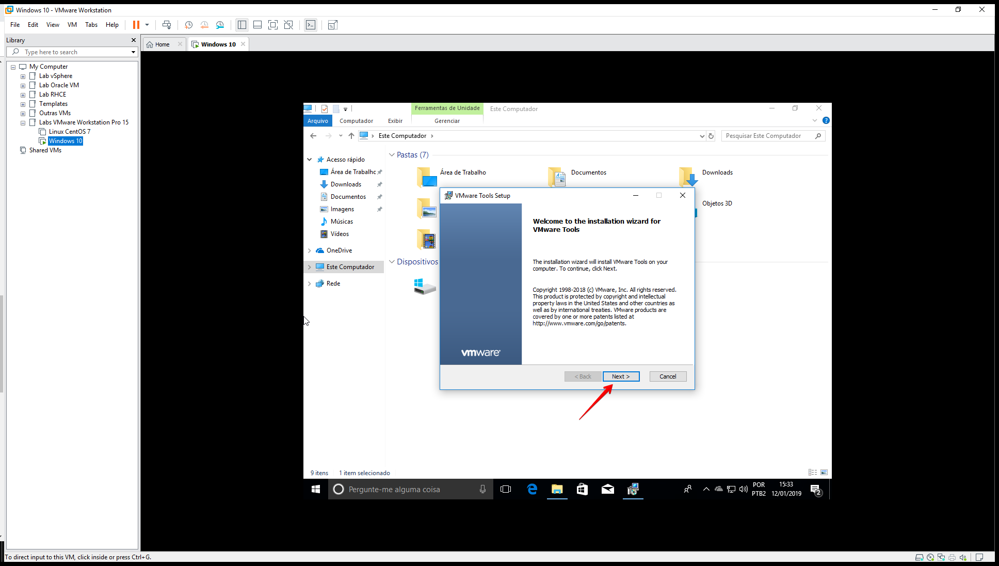
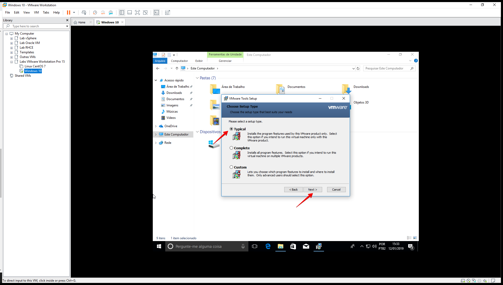
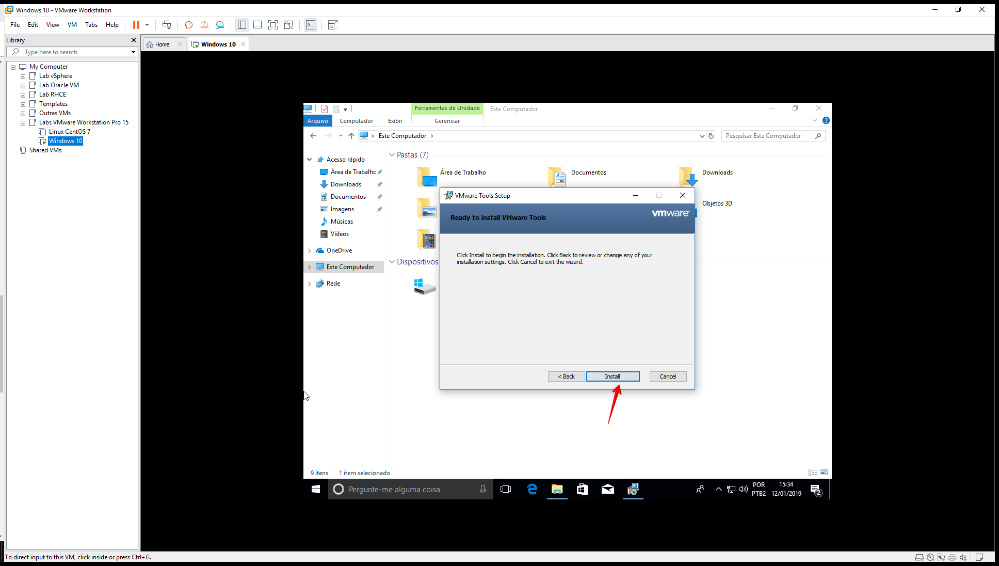
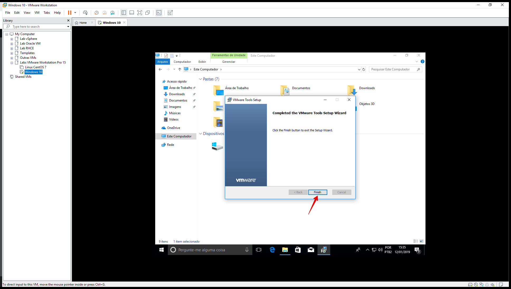
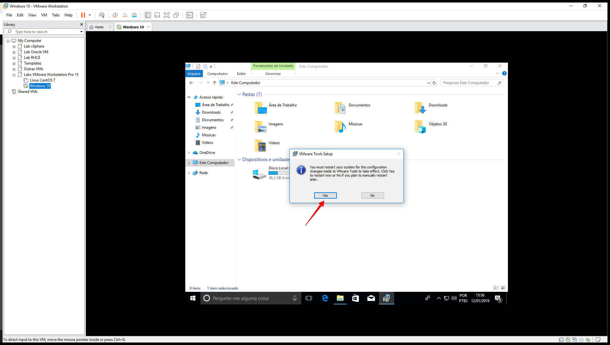
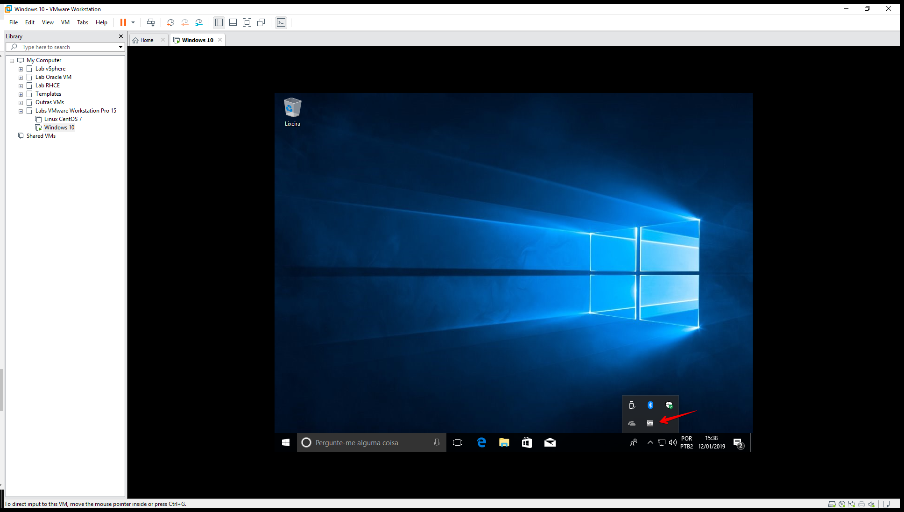
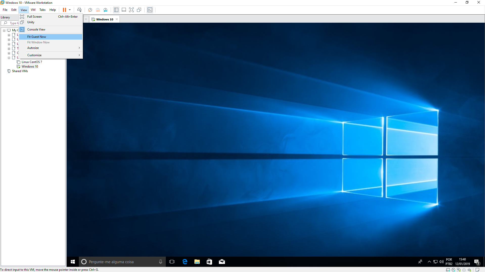

Salve Salve Pessoal!

Dando continuidade a nossa serie de posts sobre o **VMware Workstation Pro 15**, vamos ver o que é e como instalar o **VMware Tools**.

O VMware Tools é um conjunto de utilitários instalados no sistema operacional da máquina virtual.

O VMware Tools aprimora o desempenho de uma máquina virtual, segue abaixo alguns dos recursos disponíveis se o VMware Tools estiver instalado no sistema operacional da máquina virtual:

- Melhora o desempenho gráfico.
- Melhor desempenho do mouse.
- Sincronização do horário da máquina virtual com o horário do sistema operacional do host.
- Copiar e colar texto, gráficos e arquivos entre a máquina virtual e a área de trabalho do host.

Existem diversas outras features, mas nem todas estão disponíveis para todos os sistemas operacionais, para saber mais sobre quais features vai estar disponível para o sistema operacional instalado, consulte a documentação.

Vamos ao que interessa :D

Para realizar a instalação do **VMware Tools no Windows**, execute os seguintes passos:

**1** - Clique com o botão direito em cima da máquina virtual e depois clique em **Install VMware Tools...**

**2** - Vá em **Este Computador**, o software de instalação do VMware Tools vai estar montado como uma **unidade de DVD**, clique com o botão direito e depois clique em **Instale ou execute programas da mídia**.

**3** - Clique em **Sim** para permitir a instalação.

**4** - Na aba de instalação que se abre, clique em **Next**.

**5** - Selecione **Typical** para realizar a instalação padrão e clique em **Next**.

**6** - Clique em **Install**.

**7** - Clique em **Finish**.

**8** - Será solicitado a reinicialização da máquina virtual, clique em **Yes** para confirmar.

**9** - Após a máquina virtual iniciar, será exibido um **ícone** do VMware Tools na **área de notificações**.

**10** - Agora podemos usar algumas features, como a possibilidade de trabalhar em Full Scree, ocupando toda a área de trabalho, podemos usar o espaço completo do programa, entre outras possibilidades que veremos em outros posts.

**11** - Se deseja verificar os serviços que estão sendo executados, podemos ir no **gerenciador de tarefas** do windows > **serviços**.

Pronto, por enquanto é isso, no próximo post da serie veremos como instalar o **Open VM Tools** nos sistemas operacional **Linux**.

Até a próxima!

:D
