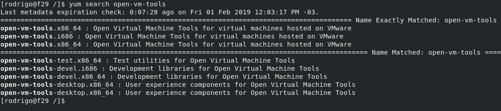
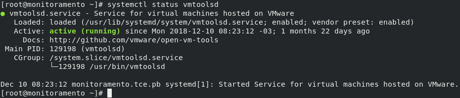

[](images/VMware-Workstation-Pro-15-Released-with-New-Features.png)

Salve Salve Pessoal!

Dando continuidade a serie de posts sobre o **VMware Workstation Pro 15** , vamos ver nesse post como instalar o **Open VM Tools** nos sistemas operacionais **Linux**.

O projeto é uma implementação de código aberto e uma alternativa ao VMware Tools.

É um conjunto de utilitários e drivers para melhorar a funcionalidade, experiência dos usuários e a administração de máquinas virtuais VMware.

O pacote contém os programas e bibliotecas  que são essenciais para melhorar a experiência e performance das máquinas virtuais.

O pacote está disponível nativamente no repositório de diversas distribuições:

**Red Hat, CentOS, Fedora, Debian, Ubuntu e várias outras.**

Para esse post vou fazer a instalação no Fedora, porém são os mesmo passos de instalação para todas as distribuições baseadas no Red Hat que utilizam o YUM e vou deixar os comandos que devem ser executados no Debian/Ubuntu e derivados.

Execute o comando abaixo para ver os pacotes disponíveis:

```
# yum search open-vm-tools (Red Hat/CentOS/Fedora e derivados)
```

```
# apt-cache search open-vm-tools (Debian/Ubuntu e derivados)
```

[](images/2019-02-01_12-11.png)

Observe que temos vários pacotes, mas precisamos nos preocupar em instalar apenas o **open-vm-tools** para servidores sem ambiente gráfico e **open-vm-tools-desktop** para servidores com  ambiente gráfico.

Para realizar a instalação, execute os seguintes comandos:

```
# yum install open-vm-tools (Red Hat/CentOS/Fedora e derivados)
```

```
# apt install open-vm-tools (Debian/Ubuntu e derivados)
```

Habilite o serviço para ser inicializado junto com o Sistema Operacional:

```
# systemctl enable vmtoolsd (Red Hat/CentOS/Fedora e derivados)

# systemctl enable open-vm-tools (Debian/Ubuntu e derivados)
```

Inicialize o serviço:

```
# systemctl start vmtoolsd (Red Hat/CentOS/Fedora e derivados)

# systemctl start open-vm-tools (Debian/Ubuntu e derivados)
```

Verifique se o serviços está em execução:

```
# systemctl status vmtoolsd (Red Hat/CentOS/Fedora e derivados)

# systemctl status open-vm-tools (Debian/Ubuntu e derivados)
```

[](images/2019-02-01_12-36.png)Pronto, Open VM Tools instalado e configurado.

Até o proximo post!

:D
