

Salve Salve Pessoal!

Dando continuidade a nossa serie de posts sobre o VMware Workstation Pro 15, hoje vamos ver como podemos criptografar nossas máquinas virtuais.

Mas qual a necessidade de criptografar uma máquina virtual?

Na grande maioria das vezes queremos proteger algum tipo de dado mais sensível que esteja dentro da máquina virtual.

Hoje existem diversos programas que são capazes de montar os discos virtuais sem a necessidade de inicializar a máquina virtual, entre eles podemos citar o **Autopsy**, com esse tipo de  programa podemos abrir o conteúdo do disco virtual sem a necessidade de iniciar a máquina virtual, ou seja, mesmo que o intruso não tenha a senha de usuário do sistema operacional da sua máquina virtual, ele será capaz obter todos os arquivos do sistema operacional virtualizado, sem contar que no caso de servidores Linux podemos redefinir a senha na inicialização do sistema e em sistemas Windows existem diversos programas para modificar a senha também.

Para maiores detalhes sobre o Autopsy visite a página do projeto:

[https://www.sleuthkit.org/autopsy/](https://www.sleuthkit.org/autopsy/)

Agora vamos ao que interessa, como podemos habilitar a criptografia.

**1** \- Clique em **Edit virtual machine settings.**

[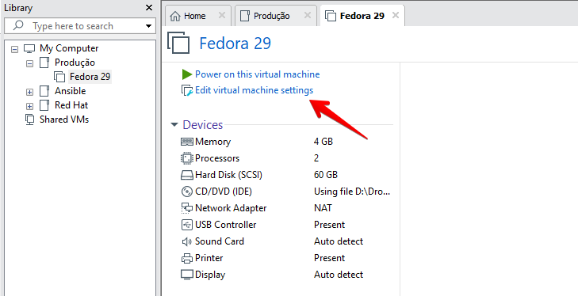](images/001.png)**2** - Cliquem em **Options** > **Access Control** > **Encrypt..**

[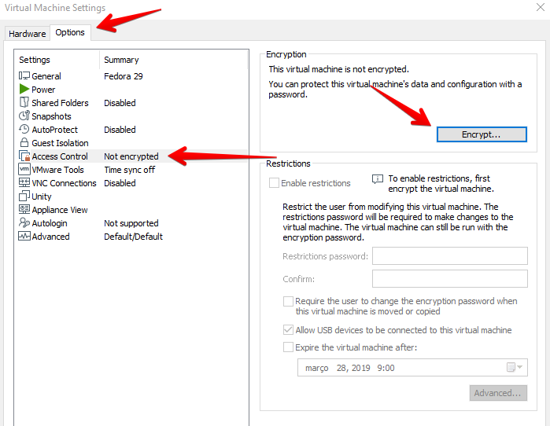](images/002.png)**3** - Configure uma **senha**, cuidado para não perder ou esquecer a senha, se você perder a senha não terá mais acesso a máquina virtual.

[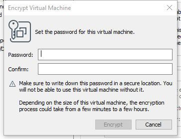](images/003.png)

**4** - Após digitar a senha clique em **Encrypt**, dependendo do tamanho do disco e do formato pode demorar um pouco

[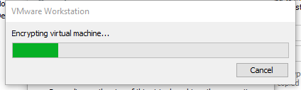](images/VMware-Workstation-2019-03-15-09.00.20.png)**5** - Depois que terminar de criptografia a máquina virtual, caso necessário podemos remover a criptografia ou até mesmo mudar a senha de acesso a máquina virtual.

[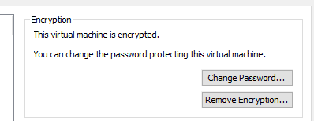](images/005.png)**6** - Clique em **OK** para fechar a janela de configuração e **feche** **a aba** da máquina virtual.

[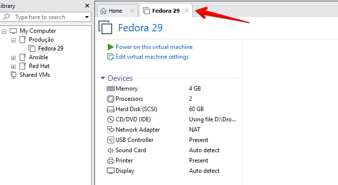](images/Fedora-29-VMware-Workstation-2019-03-15-09.08.03.png)**7** - Observe que após fecharmos a aba, o **ícone** muda e aparece agora com um **cadeado**, indicando que a máquina está criptografada e é necessário uma senha.

[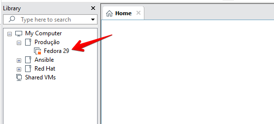](images/VMware-Workstation-2019-03-15-09.13.56.png)

**8** - Ao clicarmos em cima dela, será necessário informar a senha configurada para termos acesso a mesma.

[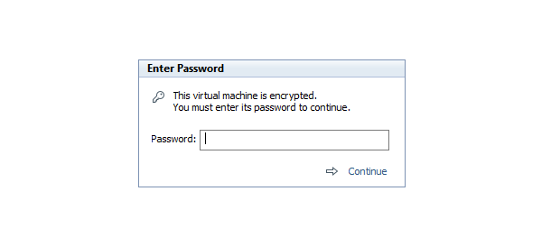](images/VMware-Workstation-2019-03-15-09.15.21.png)**9** - Depois que habilitamos a criptografia na máquina virtual, podemos restringir modificações na máquina virtual, volte em **Options** > **Access Control**, observe que agora podemos habilitar o **Enable restrictions**.

[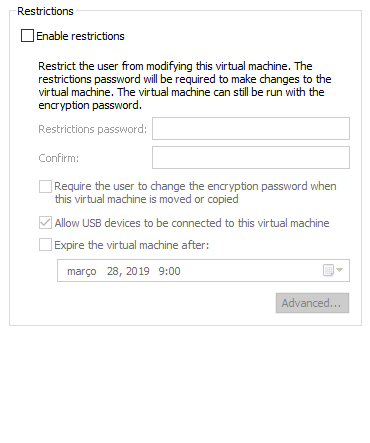](images/Virtual-Machine-Settings-2019-03-15-09.36.40.png)**10** - Habilitando o **Enable restrictions** podemos configurar uma nova senha para restringir as modificações de recursos da máquina virtual, depois de configurar essa nova senha, para realizarmos alguma alteração nas configurações da máquina virtual será necessário clicar em **Unlock All Settings** e informarmos a senha.

[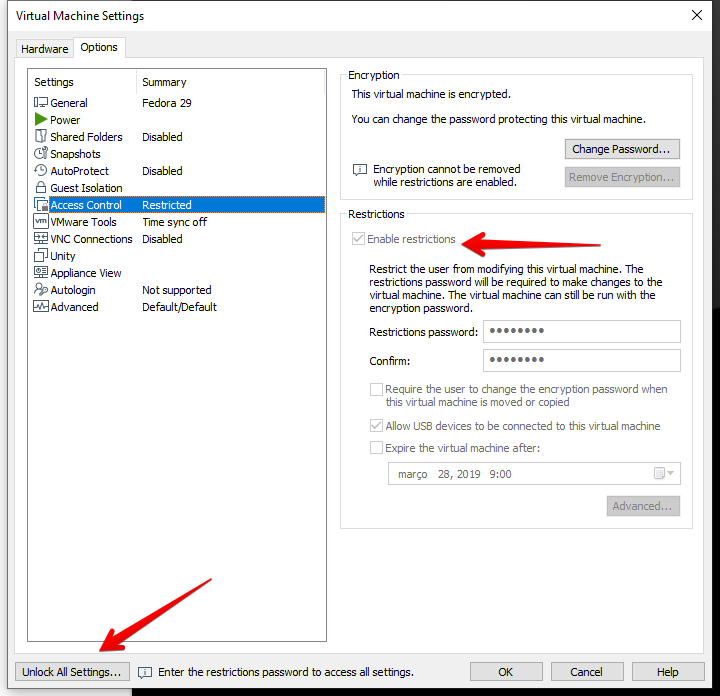](images/Virtual-Machine-Settings-2019-03-15-09.39.17.png)Também podemos fazer com que o usuário mude a senha  de criptografia da máquina virtual caso ela seja movida ou clonada.

Podemos permitir ou não a conexão de dispositivos USB.

E definir uma data de expiração dessas configurações.

[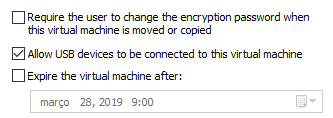](images/Virtual-Machine-Settings-2019-03-15-09.44.25.png)Pronto, com isso garantimos um nível maior de segurança no ambiente.

Espero que tenha gostado e até o próximo post!

:D
