[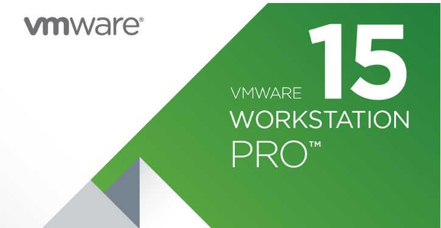](images/VMware-Workstation-Pro-15-Released-with-New-Features.png)

Salve Salve Pessoal!

Dando continuidade a serie de posts sobre o **VMware Workstation Pro 15**, vamos ver nesse post como podemos checar se existem atualizações no sistema e como configurar a checagem automatica dessas atualizações, e como instalar essas atualizações caso elas existam.

No processo de instalação do **VMware Workstation Pro 15** temos a opção de habilitar o produto para checar se existem atualizações durante a inicialização do mesmo.

[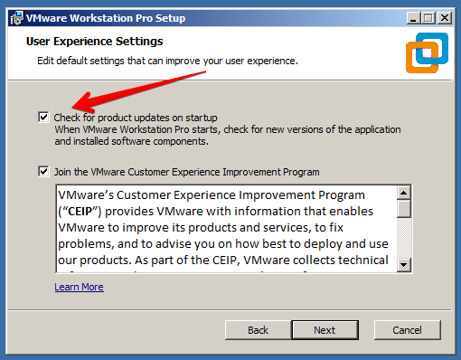](images/04.png)Porém quando não marcamos essa opção, precisamor configurar posteriormente no sistema, para isso siga os passos abaixo:

**1** - Acesse no menu **Edit** > **Preferences**, ou simplismente **Ctrl + P**.

[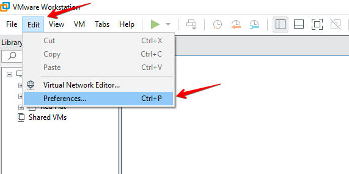](images/05.png)**2** - Selecione **Updates**.

[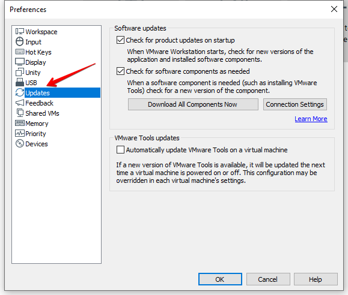](images/06.png)Vamos ver todas as opções:

**Check for product updates on startup** - verifica por atualizações ao iniciar o VMware Workstation Pro 15.

**Check for new software components as needed** - verifica por atualizações de aulgum componente, como o VMware Tools.

**Download All Components Now** - faz o download manual de todos os componentes disponíveis para o sistema host.

**Connection Settings** - configura o proxy para se conectar ao VMware Update Server, configure de acordo com a sua rede.

[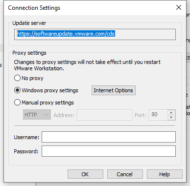](images/Connection-Settings-2019-03-15-12.13.11.png)

**Automatically update VMware Tools on virtual machine** - instala a versão mais recente do **VMware Tools** quando iniciar ou desligar o sistema operacional da máquina virtual. Podemos substituir essa configuração para máquinas virtuais específicas.

Depois das configurações realizadas clique em **OK**.

**3** - Agora clique em **Help** > **Software Updates**.

[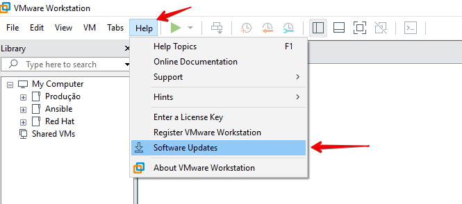](images/08.png)**4** - Agora clique em **Check for Updates**.

[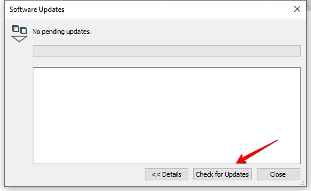](images/09.png)**5** - O software começa a verificação por atualizações.

[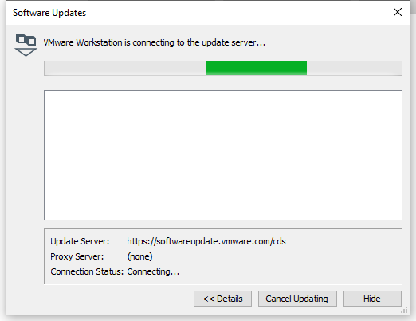](images/10.png)**6** - Achando atualizações, as mesmas são exibidas, clique em **Download and Install** para baixar e instalação a versão atualizada.

[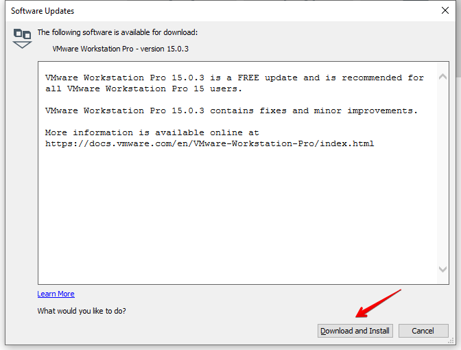](images/11.png)**7** - O download é iniciado e podemos ver o progresso do mesmo.

[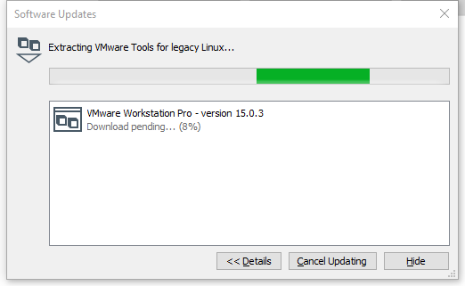](images/12.png)

**8** - Após o download ser concluido começa o processo de instalação, clique em **Next**.

[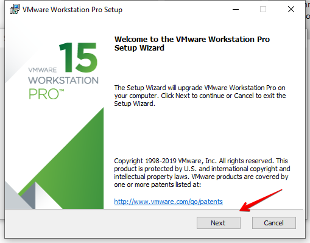](images/13.png)

Se o **VMware Workstation Pro 15** ainda estiver em execução a seguinte **mensagem** pode ser exibida.

[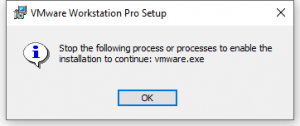](images/14.png)Feche o **VMware Workstation Pro 15** e clique em **Next** novamente.

**9** - Deste ponto em diante segue o mesmo processo de instalação, que você no primeiro post dessa serie, no link abaixo:

https://rodrigolira.eti.br/vmware-workstation-pro-15-parte-01-instalacao/

Ao final da instalação pode ser solicitado a reinicialização do sistema operacional, se for basta reiniciar.

**10** - Agora acesse o menu **Help** > **About VMware Workstation** e verifique a versão.

[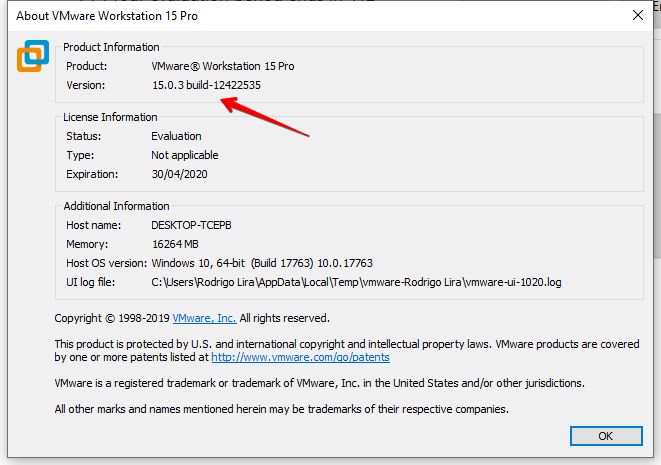](images/15.png)Pronto, VMware Workstation Pro 15 atualizado com sucesso.

Até o próximo post!

:D
