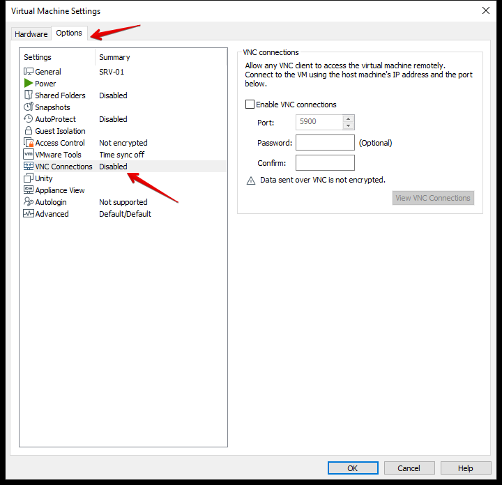
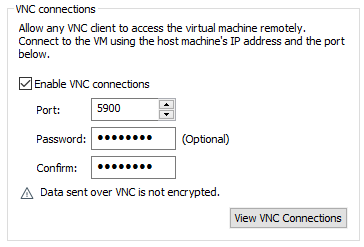
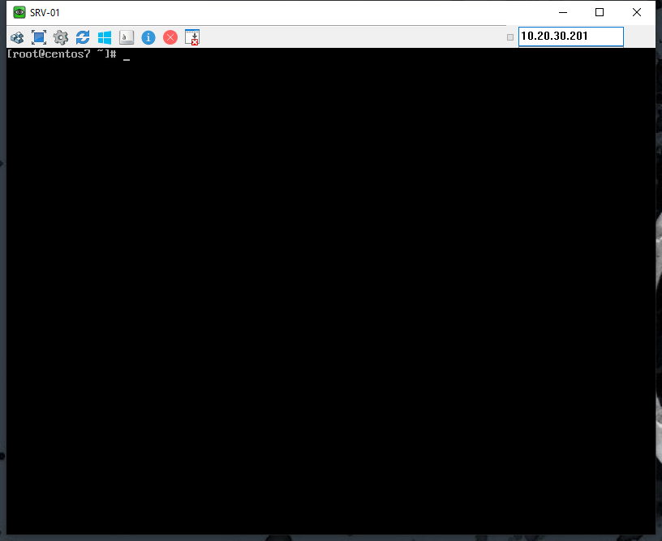
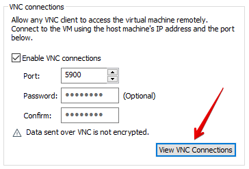
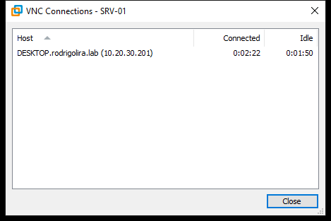

Salve Salve Pessoal!

Vamos para mais um post da nossa serie sobre o **VMware Workstation Pro 15**.

Hoje vamos ver como podemos acessar nossa máquina virtual através de um conexão remota via **VNC**.

Muitas pessoas desconhecem essa funcionalidade no **VMware Workstation Pro 15**, mas podemos configurar o **VNC** para que os usuários em outros computadores possam usar um cliente VNC para se conectar em nossa máquina virtual.

Não precisamos instalar nenhum software VNC no sistema operacional para configurá-lo como um servidor VNC, apenas precisamos habilitar a função no **VMware Workstation Pro 15**.

Para quem não conhece o **VNC** (**Virtual Network Computing**) é um protocolo que permite a visualização de interfaces gráficas remotas através da rede, para maiores detalhes acessem o link abaixo:

[https://pt.wikipedia.org/wiki/Virtual\_Network\_Computing](https://pt.wikipedia.org/wiki/Virtual_Network_Computing)

Vamos ao que interessa!

**1** - Acesse as **configurações da máquina virtual** e vá para **Options** > **VNC Connections**, se você não sabe chegar nas configurações, leia os outros posts da serie que explico como chegar.

**2** - Agora **habilite** a conexão, defina uma **porta**, o **padrão** é a **5900**, defina uma **senha** e clique em **OK**.

**3** - Agora podemos acessar a máquina virtual com um **VNC Client**.

Pronto, VNC configurado e acessível.

Se você desejar ver quem está conectado na sua máquina virtual, basta clicar em **View VNC Connections**.

Uma nova tela se abre mostrando as conexões.

**Algumas observações:**

**1** - A transmissão dos dados não são criptografados.

**2** - Se for usar para mais de uma máquina virtual é necessário alterar a porta.

**3** - A senha só poder ter no máximo 8 caracteres.

Até o próximo post!

:D
