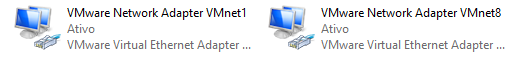
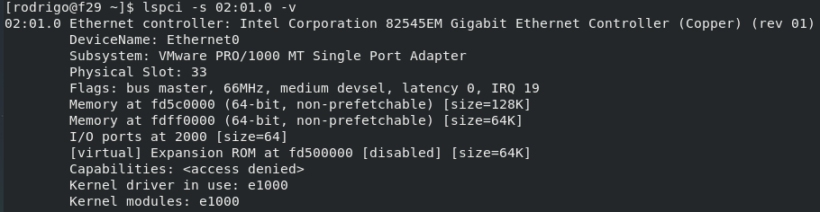
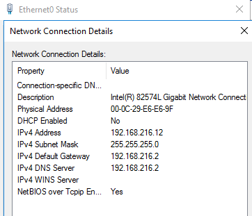
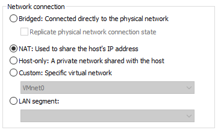
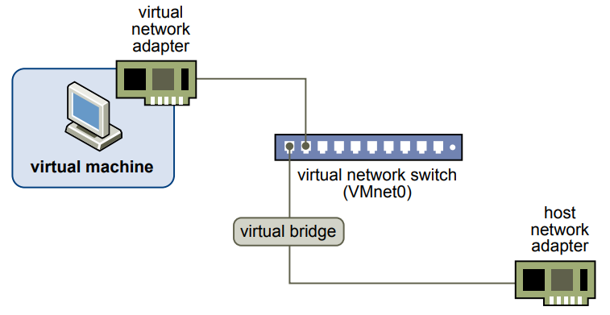
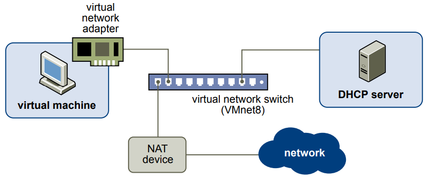
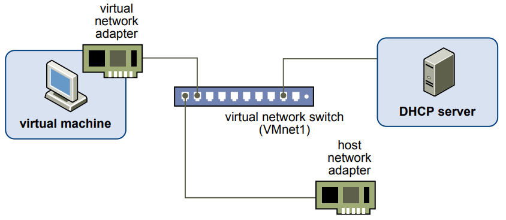
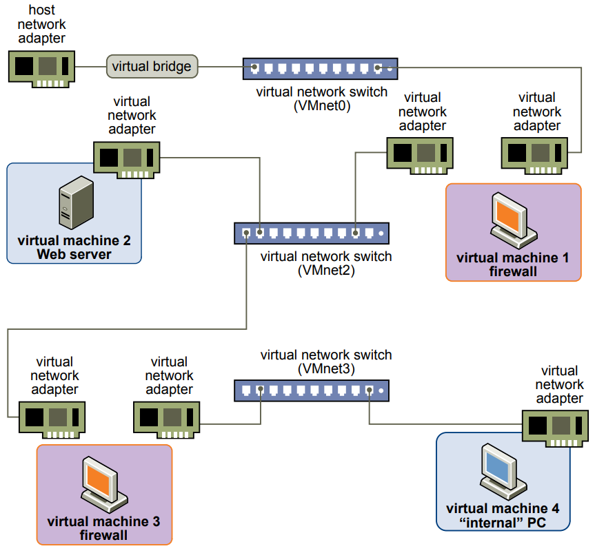

Salve Salve Pessoal!

Dando continuidade a nossa serie de posts sobre o VMware Workstation Pro 15, vamos entender os componentes de rede que podemos do VMware Workstation Pro 15.

O VMware Workstation Pro 15 inclui os seguintes componentes: **Virtual Switches** (Switches Virtuais), **Virtual Network Adapter** (Adaptador de Rede Virtual), **Virtual DHCP Server** (Servidor DHCP Virtual) e um **NAT Device** (Dispositivo NAT).

**Virtual Switches**

Os switches virtuais realizam a conexão entre as máquinas virtuais e sua respectiva redes virtual, esses switches seguem o seguinte padrão de nomeclatura **VMnet0**, **VMnet1**, **VMnet2** e assim por diante.

Por padrão alguns switches virtuais são mapeados para redes específicas, são:

**VMnet0** <--> **Bridge**

**VMnet1** <--> **Host-only**

**VMnet8** <--> **NAT**

Podemos criar até **20 switches virtuais** em sistemas operacionais **Windows** e até **255** em sistemas operacionais **Linux**, podemos conectar um número ilimitado de máquinas virtuais em um switche virtual em sistemas operacionais Windows e até 32 máquinas virtuais em sistemas operacionais Linux.

Para cada switch virtual criado do tipo **NAT** ou **Host-only** será criado uma interface no seu sistema operacional.

#### **Virtual Network Adapter**

Quando criamos uma nova máquina virtual, o assistente cria um adaptador de rede virtual para a máquina virtual, esse adaptador de rede virtual pode variar de acordo com sistemas operacionais convidados, os seguintes tipos estão disponíveis por padrão:

**AMD PCNET PCI** **Intel Pro/1000 MT** **Intel 82574L** **Intel 82545EM**

Vejam o exemplo de uma máquina virtual com o Windows Server 2016 e outra com o Fedora 29.

Podemos ter até no máximo 10 adaptadores de rede virtual por máquina virtual no VMware Workstation Pro 15.

#### **Virtual DHCP Server**

O servidor DHCP (**Dynamic Host Configuration Protocol**) fornece endereços IP as máquinas virtuais que não estão vinculadas a uma rede do tipo bridge, ou seja, o servidor **DHCP** atribui endereços IP as máquinas virtuais que estão configuradas como **Host-only** e **NAT**.

Essa configurações de endereçamento, range e etc, podem ser editadas.

#### NAT Device

No NAT (**Network Address Translation**), o dispositivo transmite dados entre uma ou mais máquinas virtuais e a rede externa, identifica pacotes de dados de entrada destinados a cada máquina virtual e os envia ao destino correto.

Para maiores informações sobre o NAT acesse o link: [https://pt.wikipedia.org/wiki/Network\_address\_translation](https://pt.wikipedia.org/wiki/Network_address_translation)

Agora vamos entender os **tipos de redes** que podemos utilizar no VMware Workstation Pro 15, temos quatro tipos de redes distintas: **Bridged**, **NAT**, **Host-only** e **Custom**.

#### **Bridged**

A rede do tipo **Bridged** conecta a máquina virtual a rede externa usando o adaptador de rede host físico, ou seja, a conexão é realizada como se você estivesse conectando a máquina virtual diretamente a rede física, outras computadores da rede vão conseguir enxergar essa máquina virtual na rede.

#### **NAT**

A rede do tipo **NAT** a máquina virtual não possui endereço IP válido na rede externa, ou seja, a rede externa não exerga essa máquina virtual na rede. Uma rede privada é configurada no host pelo VMware Workstation Pro 15, a máquina virtual obtém um endereço nessa rede privada do servidor DHCP virtual, a máquina virtual e o host comseguem se comunicar normalmente e a máquina virtual consegui acessar a rede externa através do **NAT**.

#### **Host-only**

A rede do tipo **Host-only** cria uma rede completamente contida no host, existe conexão de rede entre a máquina virtual e o sistema host, porém, diferentemente da rede do tipo NAT, a rede Host-only não tem acesso a rede externa, a máquina virtual obtém um endereço nessa rede privada do servidor DHCP virtual.

#### **Custom**

Podemos configurar um Swicthe Virtual diretamente a uma máquina virtual sem a necessidade de configurar um tipo de rede para esse switche, podendo conectar várias máquinas nesse mesmo switche, podendo fazer laboratórios mais avançados.

Também podemos um segmento de LAN, onde uma máquina virtual usa esse segmento para poder se comunicar com outras máquinas virtuais que estejam neste mesmo segmento. Os segmentos de rede local são úteis para testes de multicamadas, análise de desempenho de rede e situações em que o isolamento de máquinas virtuais é importante.

A parte de redes do VMware Workstation é muito rica e podemos fazer diversos testes, para maiores podemos acessar o guia do usuário, segue o link abaixo:

[https://docs.vmware.com/en/VMware-Workstation-Pro/15.0/workstation-pro-15-user-guide.pdf](https://docs.vmware.com/en/VMware-Workstation-Pro/15.0/workstation-pro-15-user-guide.pdf)

No próximos post dessa serie vamos ver como podemos configurar tudo isso que vimos até agora.

Até a próxima!

:D
