

Salve Salve Pessoal!

No último post da série vimos quais são os componentes de rede do **VMware Workstation Pro 15**, hoje vamos ver como podemos configurar esses componentes.

Para configurarmos os componentes de rede do **VMware Workstation Pro 15** usamos o **Virtual Network Editor**, podemos acessar ele através do menu do próprio VMware Workstation Pro 15 ou através do menu de programas do Windows ou Linux.

[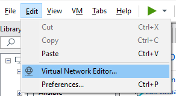](images/01-1.png)

Para realizarmos as modificações desejadas no ambiente precisamos executar o **Virtual Network Editor** como usuário **administrador/root** ou apenas clicar em **Change Settings** para mudar as permissões, o programa será fechado e se abrirá novamente.

[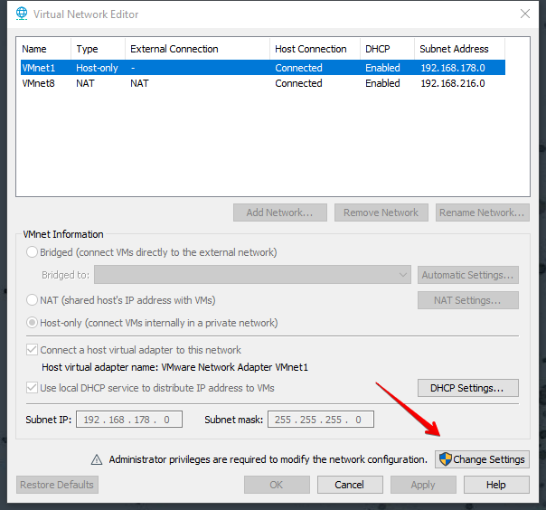](images/Virtual-Network-Editor-2019-03-29-10.13.53.png)

Depois de executarmos o programa como administrador/root podemos realizar as mudanças, vamos ver os tipos de configurações de rede uma por uma.

#### **Bridged**

Por padrão a **VMnet0** é configurada como **Bridged** e não temos um servidor DHCP Virtual habilitado nessa rede.

[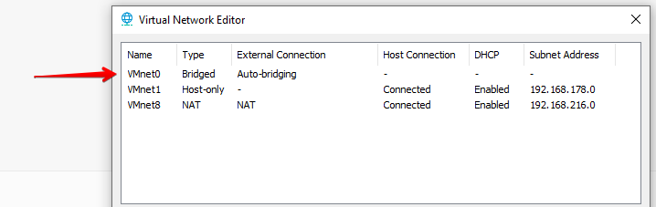](images/Virtual-Network-Editor-2019-03-29-10.30.02.png)

Como falei no post anterior esse tipo de conexão conecta a máquina virtual diretamente a rede externa, essa conexão é feita usando sua interface de rede ativa no momento e de forma automática por padrão.

[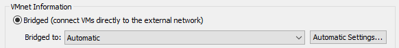](images/Virtual-Network-Editor-2019-03-29-10.25.41.png)

Se desejarmos podemos definir manualmente por qual interface a nossa máquina virtual vai se comunicar com a rede externa, basta selecionar a interface.

[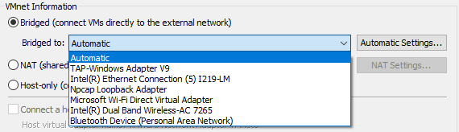](images/02-1.png)

Também podemos definir quais interfaces podem ser utilizadas, clique em **Automatic Settings** e selecione as interfaces desejadas.

[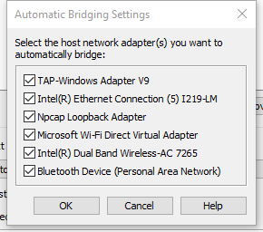](images/Automatic-Bridging-Settings-2019-03-29-10.36.53.png)

#### Host-only

Por padrão a **VMnet1** é configurada como **Host-only**, como falei no post anterior, a comunicação nesse tipo de rede limita-se entre o host e a máquina virtual.

[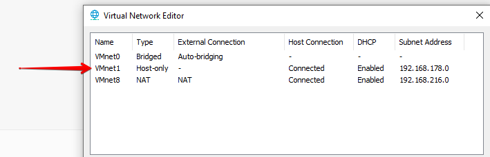](images/Virtual-Network-Editor-2019-03-29-10.30.29.png)

Por padrão temos um servidor DHCP virtual para este tipo de rede, podemos definir se se um adaptador virtual (**VMnet1**) deverá estar conectado a está rede, assim como se está rede vai usar um servidor DHCP virtual.

[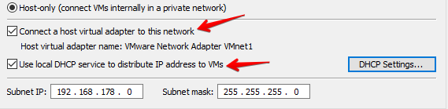](images/Virtual-Network-Editor-2019-03-29-10.44.070.png)

Caso esteja habilitado o uso do servidor DHCP virtual, podemos mudar as configurações da **sub-rede** utilizada.

[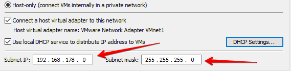](images/Virtual-Network-Editor-2019-03-29-10.44.073.png)

Clicando em **DHCP Settings** podemos mudar o range de entrega de endereços IP, o **Default lease time** e o **Max lease time**.

[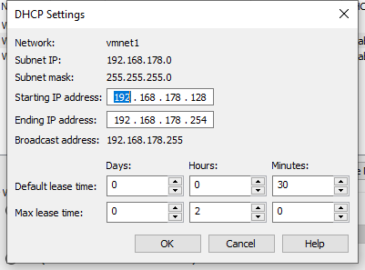](images/DHCP-Settings-2019-03-29-10.49.27.png)

#### NAT

Por padrão a **VMnet8** é configurada como **NAT**, segue os mesmo padrões de uso do servidor DHCP virtual que o tipo de rede Host-only, a diferença é que as máquinas virtuais que fazem paste desta rede conseguem se comunicar com a rede externa.

Podemos realizar configurações mais avançadas na rede tipo NAT, para isso clique em **NAT Settings**.

[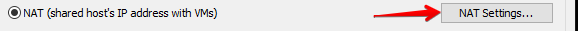](images/Virtual-Network-Editor-2019-03-29-11.00.24.png)

Nesse nova aba que se abre, podemos realizar diversas configurações:

- Mudar o endereço IP do Gateway
- Configurar Port Forwarding
- Permitir FTP
- Permitir o trafégo de OUI dos Endereços MAC
- Habilitar IPv6
- Configurar DNS e NetBIOS

[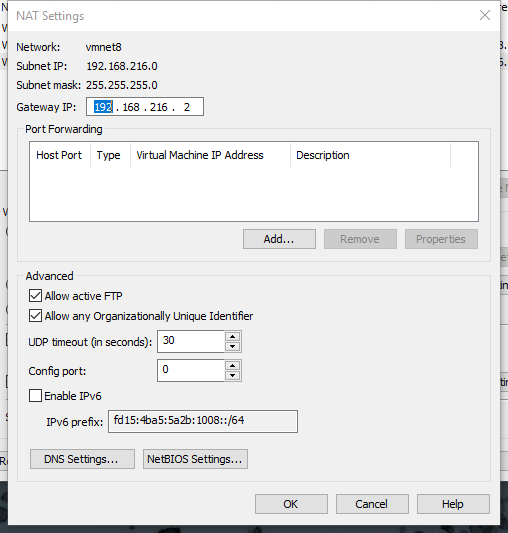](images/NAT-Settings-2019-03-29-11.02.47.png)

Vimos tudo o que podemos configurar para os três tipos de rede que podemos utilizar no **VMware Workstation Pro 15**.

Também podemos adicionar novas redes, essas novas redes só podem ser do tipo **Host-only**, podemos **renomear** essas novas redes, as redes **Defaults** (VMnet0, VMnet1 e VMnet8 não podem ser renomeadas.

[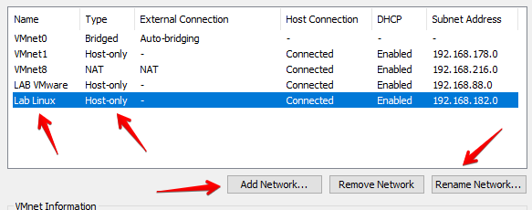](images/Virtual-Network-Editor-2019-03-29-11.29.42.png)

Podemos restaurar as configurações ao padrão com o botão **Restore Defaults**.

[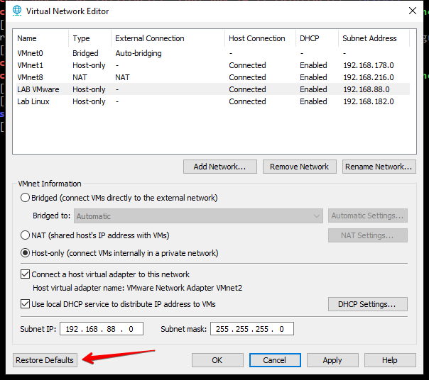](images/Virtual-Network-Editor-2019-03-29-11.32.35.png)

Pronto, é isso ai, espero que tenham gostado e até o próximo post!

:D
