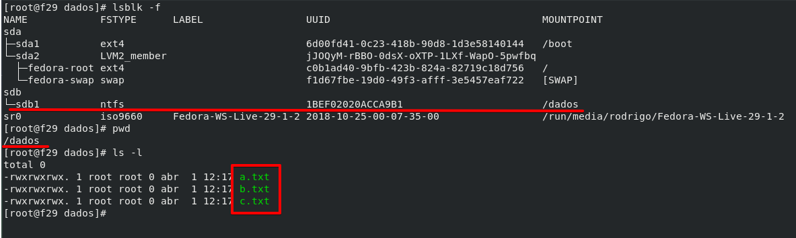
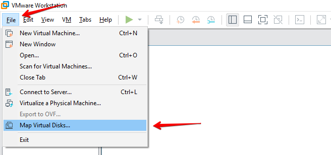
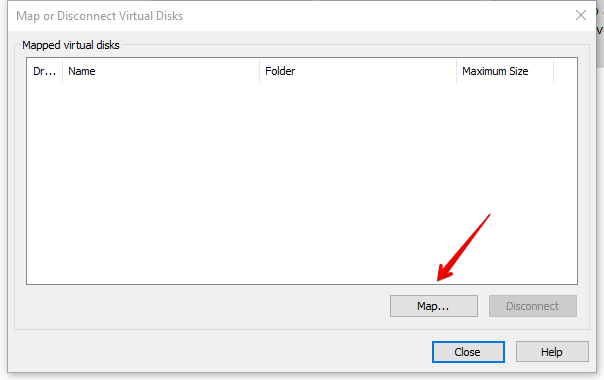
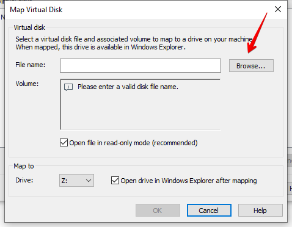
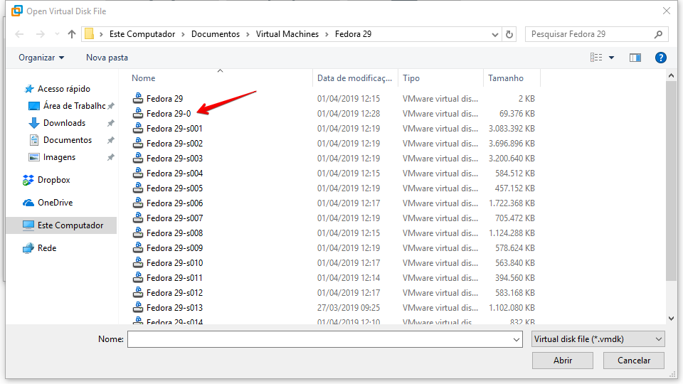
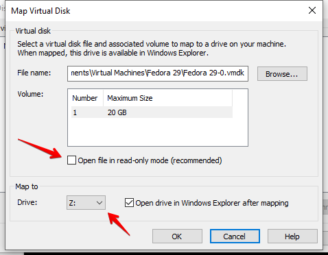
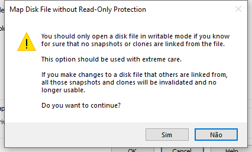
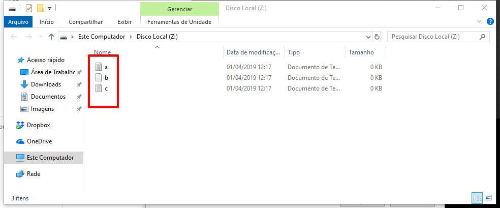

Salve Salve Pessoal!

Vamos para mais um post de nossa série sobre o **VMware Workstation Pro 15**, nesse post vamos ver como podemos com mapear um disco virtual de uma máquina virtual com o sistema operacional do host.

Isso é muito útil quando desejamos acessar alguns arquivos que estejam dentro da máquina virtual, mas não desejamos ligar a mesma.

Antes de fazer o mapeamento no meu host, vamos olhar o disco virtual que desejo compartilhar.

Como podemos ver abaixo, o sistema operacional virtualizado é um **Linux** (**Fedora 29**), o mesmo está com um **disco secundário de 20GB** (**/dev/sdb1**) e está formatado com o **sistema de arquivos NTFS**, montei esse disco no diretório **/dados** e criei **três arquivos** (**a,b e c.txt**).

Agora que já sabemos qual o disco e arquivos queremos ter acesso, vamos montar esse disco em nosso host.

Acesse o **Menu** > **File** > **Map Virtual Disk**.

 

Na nova aba que se abre clique em **Map**.

Agora clique em **Browse** e procure pelo arquivo do disco virtual, normalmente vai está em **C:\\Users\\Rodrigo Lira\\Documents\\Virtual Machines\\SUA\_MAQUINA\_VIRTUAL.**

Selecione o **disco virtual**.

Agora desmarque a opção de abrir em **read-only**, selecione a **letra do drive** clique em **OK**.

Confirme o mapeamento **sem read-only**.

Pronto, os arquivos do disco virtual estão acessivéis.

 

**OBS:** Você não poderá acessar os arquivos se o sistema de arquivos não for suportado pelo sistema operacional host, a máquina virtual precisa estar desligada para realizar o mapeamento e você só poderá ligar a máquina virtual novamente depois que remover o mapeamento.

Até o próximo post!

:D
