

Salve Salve Pessoal!

Vamos para mais um post de nossa série sobre o **VMware Workstation Pro 15**.

Hoje vamos ver como podemos compartilhar uma máquina virtual, para que outro computador que esteja executando o VMware Workstation Pro 15 em nossa rede possa ter acesso a essa máquina virtual.

Antes de mais nada precisamos verificar se o compartilhamento está habilitado, para isso acesse o **Menu** > **Edit** > **Preferences**.

[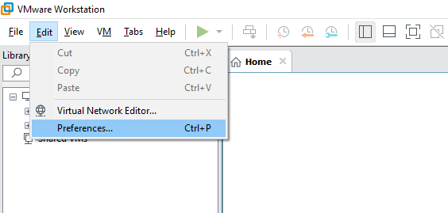](images/001-1.png)

Agora vá em **Shared VMs**, se estiver desabilitado habilite, a porta padrão é a 443, e caso deseje pode mudar as pasta padrão onde as máquinas virtuais compartilhadas são alocadas.

[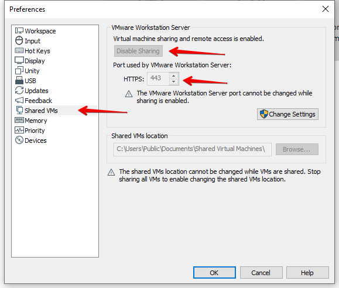](images/002-2.png)

Agora podemos compartilhar nossa máquina virtual, nós temos duas possibilidades, a primeira é criar uma nova máquina virtual já compartilhada, para isso vamos em Shared VMs e depois Create a new virtual machine, os passos de configuração da máquina virtual são os mesmos quando criamos uma máquina virtual não compartilhada.

[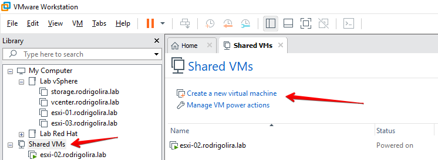](images/007-1.png)

A outra possibilidade é que podemos compartilhar uma máquina virtual já criada, para isso **clique na máquina virtual** com o botão direito do mouse, vá em **Manage** > **Share**.

[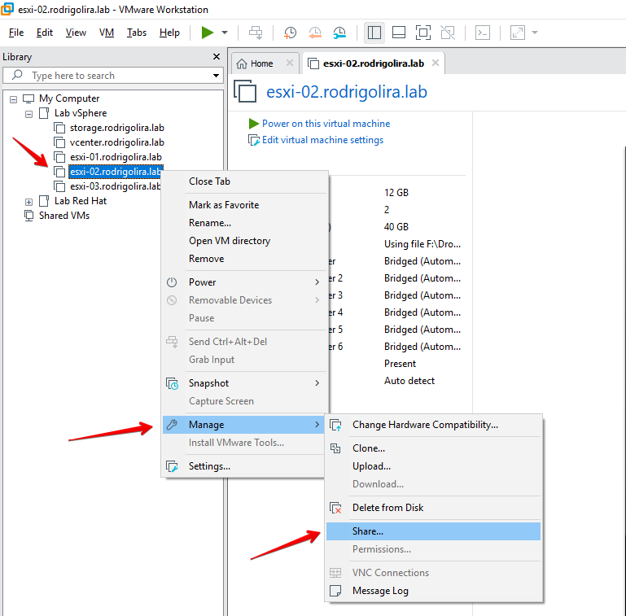](images/003-1.png)

Uma nova aba se abrirá, clique em **Next**.

[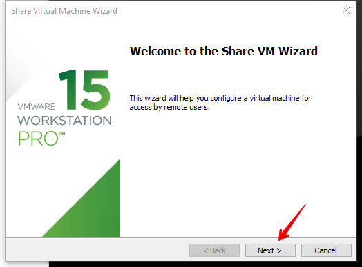](images/004-1.png)

Escolha se você deseja mover a máquina virtual para o diretório de máquinas virtuais compartilhadas ou se deseja clonar essa máquina virtual para o diretório de máquinas virtuais compartilhadas, clique em **Finish**.

[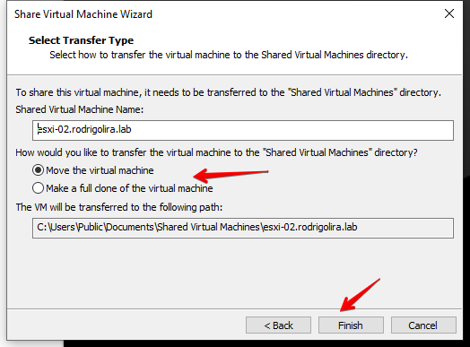](images/005-3.png)

Após isso a máquina virtual já ficara disponível no compartilhamento.

[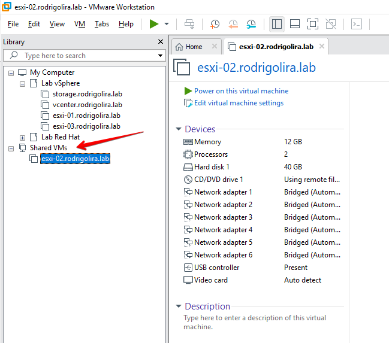](images/006.png)

Agora vamos conectar nossa máquina virtual compartilhada remotamente, de outro computador com o **VMware Workstation Pro 15** instalado, no meu caso o **VMware Workstation Pro 15** está instalado no **Fedora 29**, clique em **Connect to a Remote Server**.

[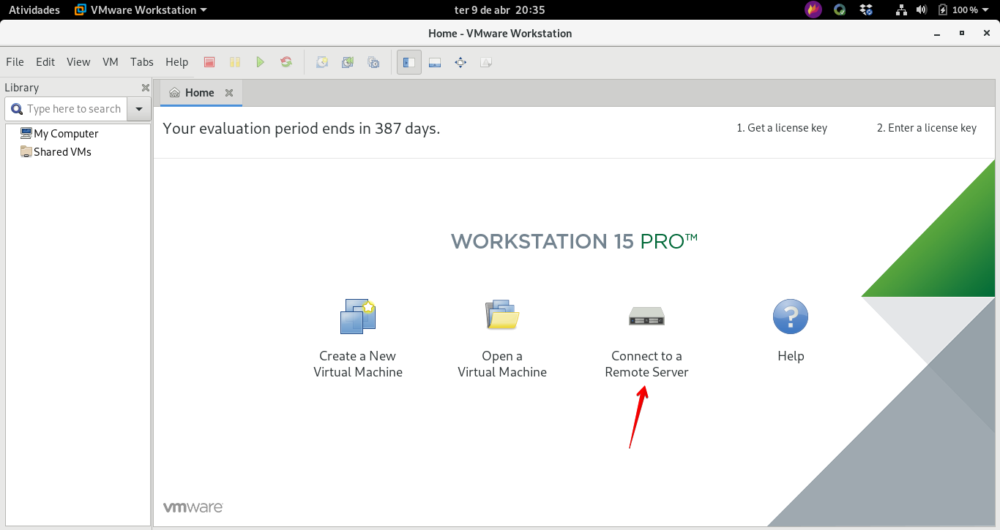](images/007-2.png)

Insira as informações de acesso, o número do **endereço IP** do host remoto com VMware Workstation Pro 15, **usuário** e **senha**.

[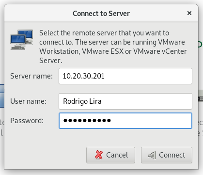](images/008.png)

Clique em **Connect Anyway** para conectar.

[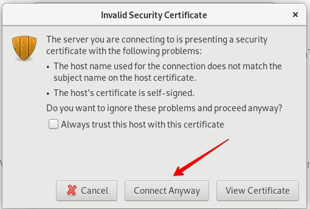](images/009.png)

Pronto, a máquina virtual compartilhada agora está acessível remotamente, nós podemos gerenciar ela da mesma forma que uma máquina virtual local, configurar os dispositivos, desligar, ligar, tirar snapshot e etc.

[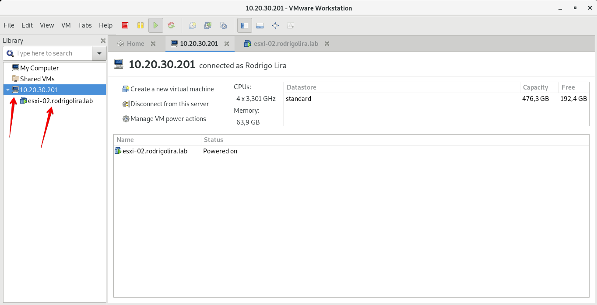](images/010.png)

Outra coisa que ganhamos quando trabalhamos com máquinas virtuais compartilhadas, é a possibilidade de darmos permissões especificas para cada usuário que se conectará a ela, para definirmos essas permissões clique com o botão direito do mouse na máquina virtual, **Manager** > **Permissions**.

[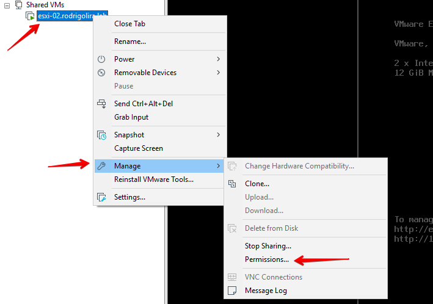](images/012.png)

Podemos dar permissões por usuário, grupos e ter roles personalizadas.

[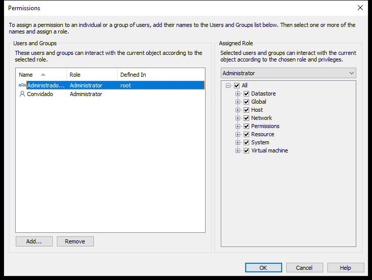](images/013.png)

Para desabilitarmos o compartilhamento, só precisamos parar o compartilhamento, clique com o botão direito do mouse na máquina virtual, **Manage** > **Stop Sharing**.

[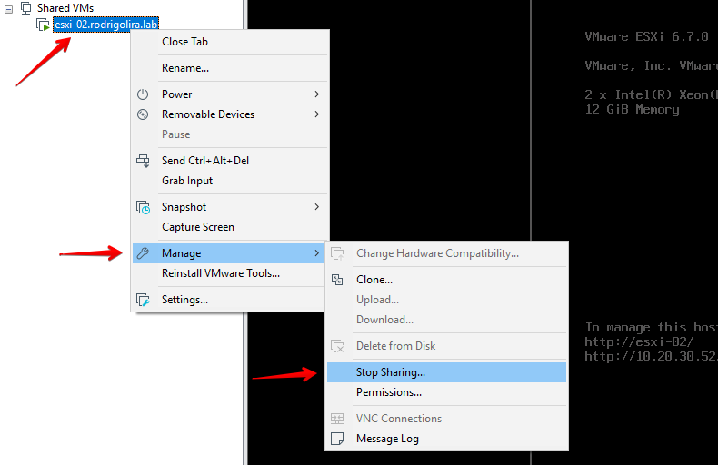](images/014.png)

Pronto, por enquanto é isso aí, até o próximo post!

:D
