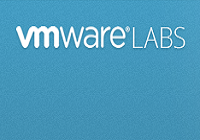
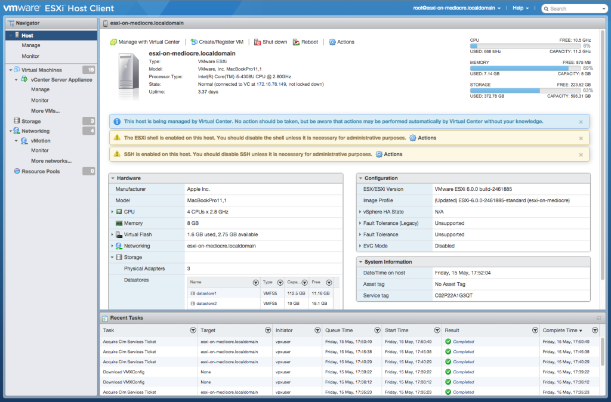

[](http://rodrigolira.eti.br/wp-content/uploads/2015/08/vmware-labs.png)Salve Salve Pessoal!

Todas as vezes que temos que acessar um host que tenha instalado o vSphere Free, nós temos que ter instalados em nosso sistema o vSphere Client, já imaginou não precisarmos mais do cliente para instalar VMs, configurar, gerenciar e etc, o pessoal da VMware Labs desenvolveu uma solução Web para este problema.

O "ESXi Embedded Host Client", este já é um projeto antigo, porém com essa nova atualização a coisa ficou bem mais legal de se ver :D

Ou seja, você consegui fazer diversas coisas sem a necessidade do client instalado em sua maquina, bastando apenas do navegador.<!--more-->

Segue abaixo uma imagem do mesmo:

[](http://rodrigolira.eti.br/wp-content/uploads/2015/08/ESXiHostClientFlingScreenShotLargest.png)Vamos ao que interessa, como instalar?

Habilite o SSH no host ESXi, acesse o mesmo e execute o seguinte comando:

```
# esxcli software vib install -v http://download3.vmware.com/software/vmw-tools/esxui/esxui-2976804.vib
```

ou

Mova o arquivo através do SCP para dentro do host ESXi, para dentro da pasta /tmp e depois execute o seguinte comando:

```
# esxcli software vib install -v /tmp/esxui-2976804.vib
```

Pronto, feito isso basta acessar seu host através do seguinte endereço:

```
https://ip_do_host/ui
```

OBS: Caso venha acontecer de o navegador ficar apresentando erros com a seguinte mensagem:

```
[missing “pt-br.host.summary.actionBar.createRegisterVM.label” translation]
```

Basta executar o seguinte comando para corrigir o problema:

```
cp -rf /usr/lib/vmware/hostd/docroot/ui/i18n/en-us/*.* /usr/lib/vmware/hostd/docroot/ui/i18n/pt-br/
```

Pronto, espero que possa ser útil para vocês, porque para mim está sendo e muito.

Para maiores informações segui a página no projeto:

[https://labs.vmware.com/flings/esxi-embedded-host-client](https://labs.vmware.com/flings/esxi-embedded-host-client)

Até a próxima :D
