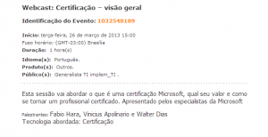

Salve Salve Galera!

Como mostrado no post anterior sobre WWE, aqui vai o primeiro de vários posts que vou colocar aqui no blog sobre os webcasts da Microsoft, e como não poderia deixar de ser o primeiro é sobre Certificações Microsoft, uma visão geral sobre as certificações oferecidas pela Microsoft. Segue o link para inscrição:

[https://msevents.microsoft.com/cui/r.aspx?t=4&c=pt-br&r=1313114788&community=0&a=0](https://msevents.microsoft.com/cui/r.aspx?t=4&c=pt-br&r=1313114788&community=0&a=0)
