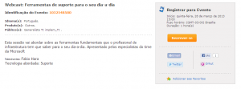

Salve Salve Galera!

Olha ai mais um webcast da Microsoft sobre ferramentas para o dia-a-dia, houve um outro desses faz pouco tempo mais não teve como eu participar, mas esse com certeza não perco por nada. Segue o link para o webcast:

[https://msevents.microsoft.com/CUI/EventDetail.aspx?EventID=1032548580&Culture=pt-BR&community=0](https://msevents.microsoft.com/CUI/EventDetail.aspx?EventID=1032548580&Culture=pt-BR&community=0)
