[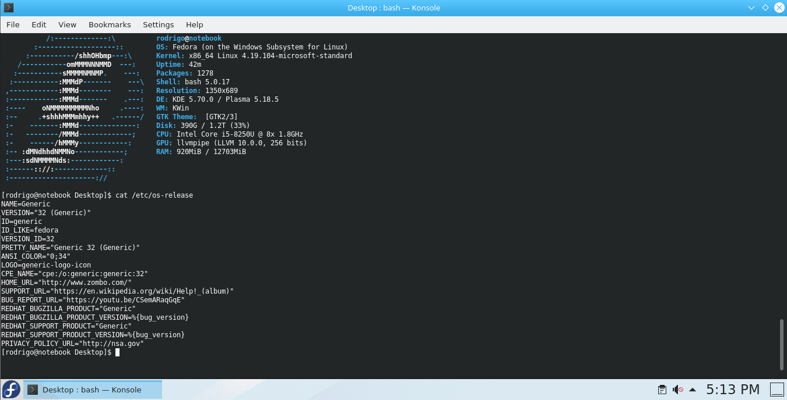](images/fedora-x410.png)

Salve Salve Pessoal!

Hoje vou mostrar como podemos executar o nosso querido fedora usando o **WSL2** do **Windows**.

Para quem não conhece o WSL do Windows ele permite que executemos um Linux diretamente no Windows.

Não vou entrar em detalhes, para maiores informações acessem o link abaixo:

[https://docs.microsoft.com/pt-br/windows/wsl/about](https://docs.microsoft.com/pt-br/windows/wsl/about)

Bem, imagino que você leu o link acima, agora que você já sabe o que é o WSL vamos ao que interessa.

Antes de instalarmos o WSL2 precisamos verificar nossa versão do **Windows 10**, pois precisamos da versão mais recente atualmente, no caso a versão **2004 Build 19041**.

Aperte as teclas **Windows + R** para abrir o executar e digite **winver** e clique em **OK**.

[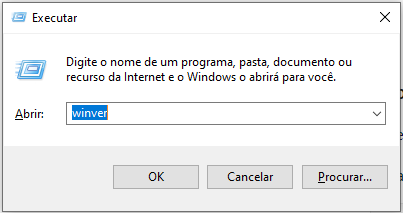](images/00.png)

Uma nova janela se abrirá com as informações que precisamos.

[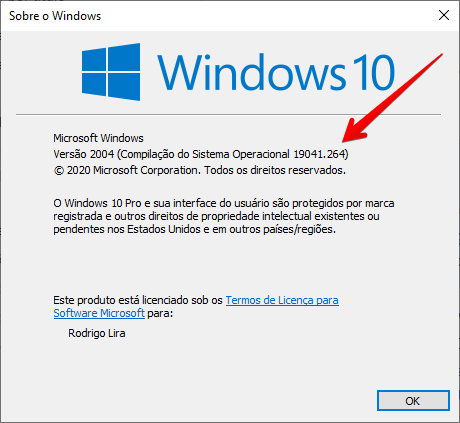](images/0001.png)

Agora que já sabemos a nossa versão podemos prosseguir para a instalação do **WSL2**, se seu sistema não estiver nessa versão ou mais atual **atualize ele**.

Primeiro vamos instalar o **WSL** em nosso sistema, abra o **PowerShell** como **administrador** e execute o comando abaixo:

```
dism.exe /online /enable-feature /featurename:Microsoft-Windows-Subsystem-Linux /all /norestart
```

[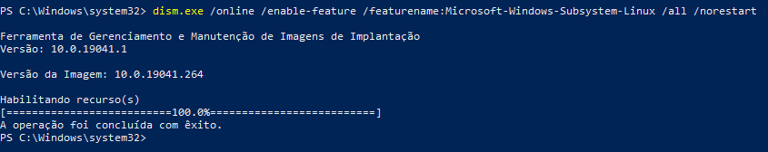](images/01.png)

**OBS:** Por padrão até o momento quando fazemos a instalação do **WSL** estamos fazendo a instalação da **versão 1**.

Para definirmos o **WSL versão 2** como padrão precisamos habilitar o recurso de plataforma de máquina virtual, execute o comando abaixo:

```
dism.exe /online /enable-feature /featurename:VirtualMachinePlatform /all /norestart
```

[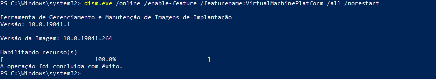](images/02.png)

Reinicie o computador.

Agora precisamos fazer uma atualização no kernel do Windows 10, baixe e instale o seguinte pacote:

[https://wslstorestorage.blob.core.windows.net/wslblob/wsl\_update\_x64.msi](https://wslstorestorage.blob.core.windows.net/wslblob/wsl_update_x64.msi)

Agora vamos definir o WSL para versão 2, execute o seguinte comando:

```
wsl --set-default-version 2
```

[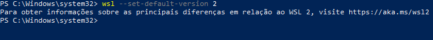](images/03.png)

Pronto, agora já temos o nosso Windows 10 com WSL2, vamos as configurações do Fedora.

Abra a **Microsoft Store** e pesquise por **Fedora Remix**.

[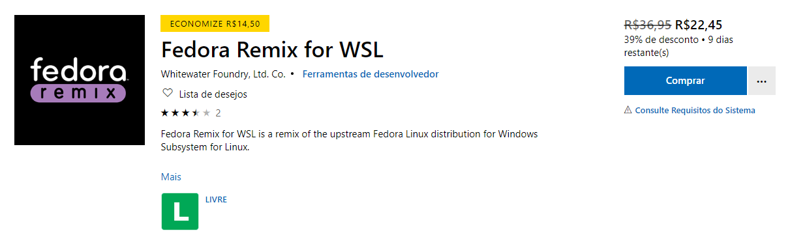](images/fedora.png)

**Opa isso é pago?**

**Sim**, essa versão do **Fedora** é uma versão fornecida por uma empresa, existem possibilidades de construirmos nossas próprias versões de forma gratuita, mas como o valor é muito baixo e eu não quis ter esse trabalho decidi comprar.

**OBS:** Podemos fazer uso de distros como **Ubuntu** e **Debian**, porém gosto e prefiro a família da Red Hat.

Após fazer a instalação do **Fedora Remix** inicie ele e configure seu **usuário** e **senha**.

[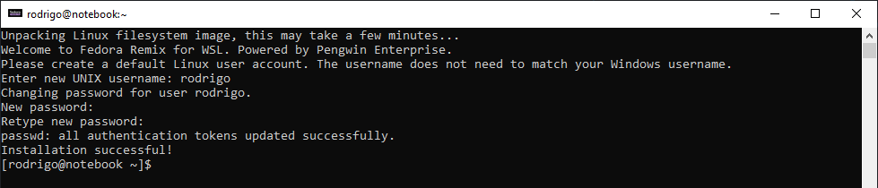](images/05.png)

A versão atual do **Fedora Remix** é a **31.5.0** baseada no **Fedora 31**.

```
# cat /etc/os-release
```

[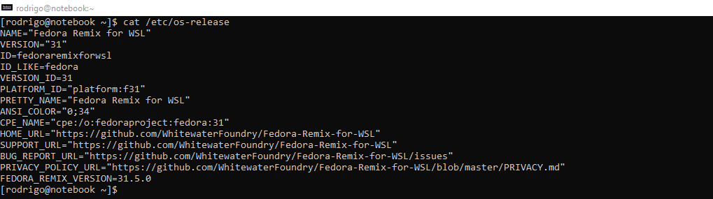](images/06.png)

Vamos fazer o upgrade para versão **32**.

Mas primeiro vamos fazer um backup na raiz da unidade **C:**, abra o powershell como administrador e execute os seguintes comandos:

```
cd ..\..
```

```
wsl --export fedoraremix fedoraremix31_backup.tar.gz
```

[](images/07.png)

**OBS:** Você pode fazer o backup em um diretório diferente.

Agora no **Fedora Remix** execute os seguintes comandos:

```
# sudo upgrade.sh
```

```
# sudo dnf -y upgrade --refresh
```

```
# sudo dnf -y install dnf-plugin-system-upgrade
```

```
# sudo dnf -y system-upgrade --allowerasing --skip-broken download --releasever=32
```

```
# sudo dnf -y system-upgrade reboot (ignore os erros)
```

```
# sudo dnf -y system-upgrade upgrade (ignore os erros)
```

```
# sudo dnf -y autoremove
```

```
# sudo dnf -y clean all
```

**OBS:** **Ignore os erros e continue executando os comandos.**

Agora feche e abra o Fedora Remix novamente.

E vamos verificar novamente a versão, execute o comando:

```
# cat /etc/os-release
```

[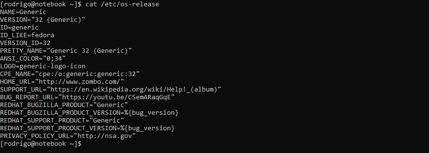](images/08.png)

Como podemos ver na imagem acima estamos na versão 32.

:D

Agora vamos a instalação do ambiente **KDE**.

Execute o seguinte comando:

```
# sudo dnf -y install @kde-desktop
```

Será feito o download de todo o ambiente **Desktop** do **KDE**.

Para podermos executar o ambiente gráfico precisamos de um **servidor X Window**, nesse caso estou usando o **X410** que também está disponível na Microsoft Store.

[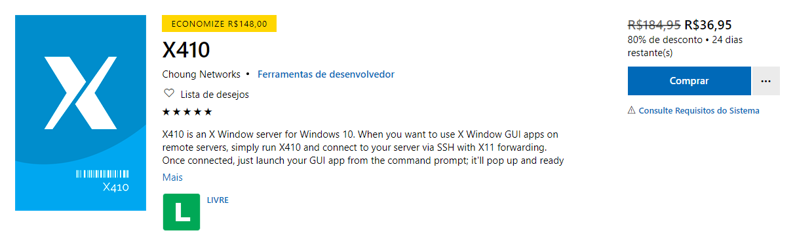](images/x410.png)

**Opa, pago também?**

Sim, esse aplicativo também é pago, porém o valor dele também é muito baixo e é o servidor X Window recomendando pela empresa do Fedora Remix.

Imagino que não haverá problema nenhum em excutar outro, porém achei mais comodo o uso dele, alem de ser muito fácil de usar.

Faça a instalação dele e depois execute o mesmo, um ícone irá aparecer na **Área de Notificações**, clique nele e depois clique em **Allow Public Access** para permitir a comunicação do **X410** pela rede.

[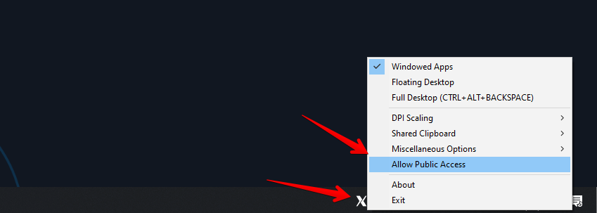](images/100-1.png)

Clique em **OK** para continuar e permitir o acesso.

[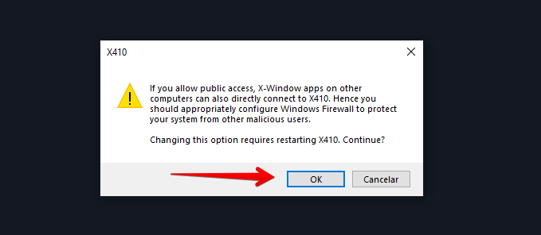](images/101.png)

Marque **Redes privadas** e **Redes públicas** e clique em **Permitir acesso**.

[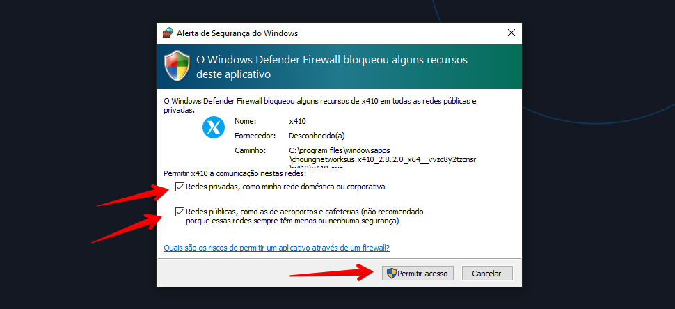](images/102.png)

Agora no Fedora Remix precisamos atualizar a variável de ambiente **DISPLAY**.

Execute o seguinte comando:

```
# export DISPLAY=$(cat /etc/resolv.conf | grep nameserver | awk '{print $2; exit;}'):0.0
```

Agora só iniciarmos o **KDE**.

Execute o comando abaixo:

```
# startkde
```

O ambiente desktop é exibido na janela do **X410**, como na imagem abaixo:

[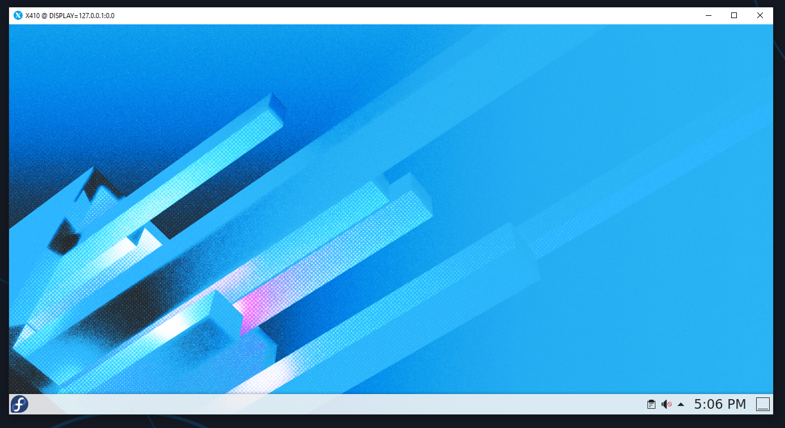](images/103.png)

A ordem de inicialização não importa, você pode iniciar o KDE e depois iniciar o X410 ou iniciar o X410 e depois iniciar o KDE.

Se desejar podemos criar um script **.bat** para automatizar a inicialização do X410 e Fedora Remix, segue abaixo uma cópia do meu:

```
start /B x410.exe /desktop
fedoraremix.exe run "if [ -z \"$(pidof startkde)\" ]; then export DISPLAY=$(cat /etc/resolv.conf | grep nameserver | awk '{print $2; exit;}'):0; startkde; pkill '(gpg|ssh)-agent'; fi;"
```

Pronto, tudo instalado e configurado com sucesso.

Espero que tenham gostado do post.

Até a próxima!

:D

**Referências:**

[https://docs.microsoft.com/pt-br/windows/wsl/about](https://docs.microsoft.com/pt-br/windows/wsl/about)

[https://docs.microsoft.com/pt-br/windows/wsl/install-win10](https://docs.microsoft.com/pt-br/windows/wsl/install-win10)

[https://docs.microsoft.com/pt-br/windows/wsl/wsl2-kernel](https://docs.microsoft.com/pt-br/windows/wsl/wsl2-kernel)

[https://www.whitewaterfoundry.com/blog/2019/11/3/upgrade-fedora-remix-for-wsl-to-31-2a7z8](https://www.whitewaterfoundry.com/blog/2019/11/3/upgrade-fedora-remix-for-wsl-to-31-2a7z8)

[https://www.whitewaterfoundry.com/blog/2020/4/10/installing-mate-in-fedora-remix-for-wsl](https://www.whitewaterfoundry.com/blog/2020/4/10/installing-mate-in-fedora-remix-for-wsl)

[x410.dev/cookbook/wsl/using-x410-with-wsl2/](https://x410.dev/cookbook/wsl/using-x410-with-wsl2/)
