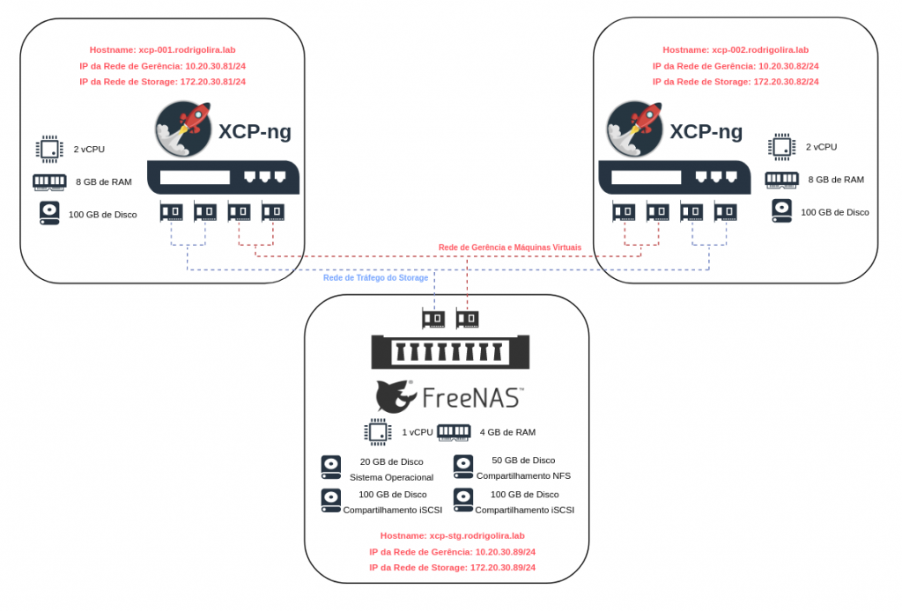

Salve Salve Pessoal!

Nesse segundo vídeo de nossa série sobre a solução de virtualização **XCP-ng** eu mostro como será a arquitetura de nosso laboratório, como criar e configurar as máquinas virtuais no ESXi e o recurso utilizado por cada uma delas.

Se você não assistiu o primeiro vídeo acesse o link abaixo e assisita:

https://rodrigolira.eti.br/virtualizacao-com-xcp-ng-introducao/

Para visualizar todos os vídeos dessa série acesse a playlist no link abaixo:

https://www.youtube.com/playlist?list=PLc6zDeh3jsIVHpwSEhLGdCnOFGe0Be6ko

Até o próximo post!

:D
