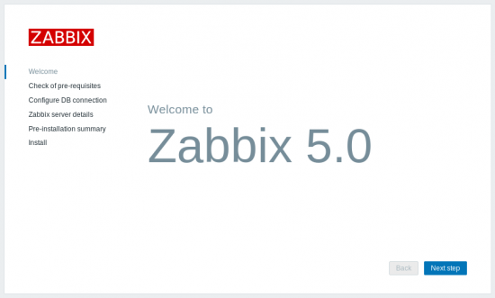

Salve Salve Pessoal!

Hoje foi o lançamento da nova versão **LTS** do **Zabbix**, o **Zabbix 5.0**.

Com essa nova versão temos diversas melhorias, entre elas podemos citar:

- Novo design na interface Web.
- Nova versão do Zabbix Agent.
- Novas integrações com ITMS.
- Novas integrações com sistemas de alertas.
- Novos Templates.
- Novos recursos de segurança.
- Suporte a novos sistema operacionais.
- Etc...

Mas para mim o que estava mais ansioso com essa nova versão era poder começar uma nova serie de vídeos.

Algumas pessoas sempre me pedem para fazer vídeos sobre o Zabbix, pois bem vou começar a fazer, estava apenas esperando essa nova versão para começar a gravar.

Por enquanto é apenas isso.

Até a próxima!

:D
