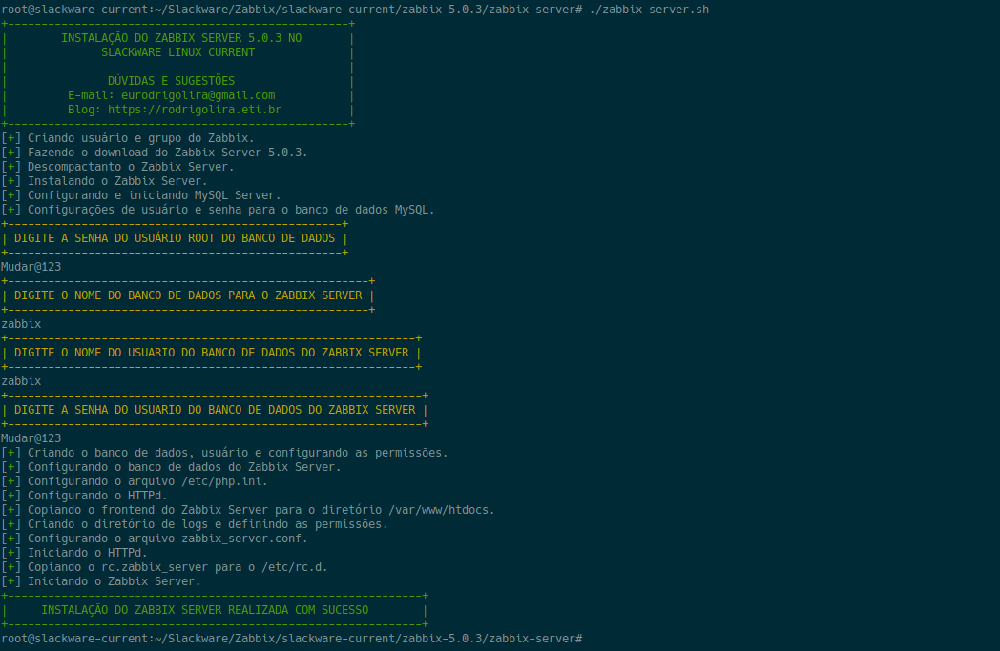

Salve Salve Pessoal!

Faz algum tempo que deveria ter feito esse post e sempre venho adiando querendo melhorar um pouco mais os **scripts**. :D

Para os usuários do **Slackware** sabemos que não existem pacotes do **Zabbix** nativos disponíveis, dessa forma temos duas opções, uma é fazer a instalação via **Slackbuilds** e a outra é **compilar manualmente**.

Os pacotes do **Zabbix**  no **Slackbuils** ainda estão na versão **4.4.x**, dessa forma resolvi criar os scripts personalizados para fazer a compilação do **Zabbix 5** no **Slackware Current**.

Atualmente tenho scripts para instalação do **Zabbix Server**, **Zabbix Agent** e **Zabbix Proxy** nas versões do Zabbix **5.0.1**, **5.0.2** e **5.0.3**.

Segue o link para acesso aos scripts:

[https://github.com/eurodrigolira/Slackware](https://github.com/eurodrigolira/Slackware)

O script do **Zabbix Server** além de fazer a instalação do Zabbix Server, configura o banco de dados **MariaDB**, o **PHP** e o **HTTPd**.

O script do **Zabbix Proxy** além de fazer a instalação do Zabbix Proxy também configura o banco de dados **MariaDB**.

O script do **Zabbix Agent** faz a instalação apenas do agente mesmo.

Os scripts do Zabbix Server e Proxy esperam que os servidores sejam dedicados apenas a esses serviços, dessa forma se você estiver executando algum outro serviço adeque os scripts a sua necessidade.

Estou fazendo os scripts de atualização de uma versão para outra e do agent2, em breve devo disponibilizar.

Dúvidas e sugestões são bem vindas!

Até o próximo post.

:D
