[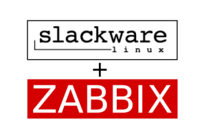](images/zabbix-slackware.png)

Salve Salve Pessoal!

Nesse post vou mostrar como podemos fazer a instalação do **Zabbix 7** no **Slackware 15**.

Diferentemente de outras distribuições, não temos pacotes oficiais da Zabbix SIA para o Slackware, mas nada que não possamos criar nosso próprios pacotes, já que eles disponibilizam o código fonte.

Como falei em um dos meus posts anteriores, estou disponibilizando os pacotes que eu crio para o Slackware, e alguns desses pacotes são referentes ao Zabbix 7, assim como as suas dependências.

Esse post está dividido em três parte, uma onde vamos instalar e configurar o Zabbix Server e o banco de dados MariaDB, outra onde vamos configurar o apache e o php para o frontend do Zabbix e por fim o Zabbix Agent.

Todos os pacotes que vou utilizar nesse post podem ser baixados na seguinte URL.

**[https://slackbuilds.rodrigolira.eti.br](https://slackbuilds.rodrigolira.eti.br)**

Pode ser que a versão do Zabbix tenha mudado, então fique atento as URLs utilizadas nos comandos do post, vou destacar as partes que fazem referência a versão dos pacotes, nesse caso será necessário mudar o comando apenas para a versão disponível no momento.

## Configuração do Zabbix Server

No Slackware a unica dependência que temos para o Zabbix Server é o unixODBC, então a primeira coisa que precisamos fazer é a instalação do pacote, você pode baixar o mesmo no link abaixo:

[https://slackbuilds.rodrigolira.eti.br/slackware64-15.0/unixODBC/](https://slackbuilds.rodrigolira.eti.br/slackware64-15.0/unixODBC/)

```
# wget https://slackbuilds.rodrigolira.eti.br/slackware64-15.0/unixODBC/unixODBC-2.3.11-x86_64-1_SBo.tgz
```

Agora vamos instalar o pacote.

```
# installpkg unixODBC-2.3.11-x86_64-1_SBo.tgz
```

Precisamos criar o usuário e grupo do zabbix server e do zabbix agent, execute os comandos abaixo.

```
# groupadd -g 228 zabbix

# useradd -u 228 -g zabbix -d /dev/null -s /bin/false zabbix

# useradd -u 266 -g zabbix -d /dev/null -s /bin/false zabbixagent
```

Vamos baixar os pacotes do zabbix server, frontend e agent.

```
# wget https://slackbuilds.rodrigolira.eti.br/slackware64-15.0/zabbix-7.0/zabbix_server/zabbix_server-7.0.3-x86_64-1_SBo.tgz

# wget https://slackbuilds.rodrigolira.eti.br/slackware64-15.0/zabbix-7.0/zabbix_frontend/zabbix_frontend-7.0.3-noarch-1_SBo.tgz

# wget https://slackbuilds.rodrigolira.eti.br/slackware64-15.0/zabbix-7.0/zabbix_agent2/zabbix_agent2-7.0.3-x86_64-1_SBo.tgz
```

Agora  vamos fazer a instalação de cada um dos pacotes.

```
# installpkg zabbix_server-7.0.3-x86_64-1_SBo.tgz

# installpkg zabbix_frontend-7.0.3-noarch-1_SBo.tgz

# installpkg zabbix_agent2-7.0.3-x86_64-1_SBo.tgz
```

Por padrão o **Slackware** já vem com o **MariaDB** instalado, o que precisamos fazer é configura-lo.

Primeiro precisamos instalar as bases do sistema.

```
# mysql_install_db
```

Agora precisamos configurar as permissões.

```
# chown -R mysql:mysql /var/lib/mysql
```

Vamos configurar a permissão do script de inicialização para o MariaDB inicializar junto com o sistema operacional.

```
# chmod 755 /etc/rc.d/rc.mysqld
```

E vamos inicializar o MariaDB.

```
# /etc/rc.d/rc.mysqld start
```

Por fim vamos configurar a senha para o usuário root do MariaDB.

```
# mysqladmin -u root password 'Mudar@123'
```

Observe que **Mudar@123** é a senha que eu estou definindo, no caso de vocês deve ser uma senha diferente e bem mais forte que essa.

Pronto, MariaDB configurado. :D

Agora vamos criar o banco de dados para o Zabbix Server, vamos logar no MariaDB.

```
# mysql -u root -pMudar@123
```

Vamos criar o banco de dados para o Zabbix com o seguinte comando.

```
> create database zabbix character set utf8mb4 collate utf8mb4_bin;
```

No meu caso criei um banco de dados com o nome **zabbix** mesmo, no seu pode ser diferente caso deseje.

Agora vamos criar o usuário e configurar as permissões.

```
> use mysql;

> grant all privileges on zabbix.* to zabbix@localhost identified by 'Mudar@123';

> flush privileges;

> quit
```

Observe que criamos um usuário chamado **zabbix**, com a senha **Mudar@123**, que tem permissão no banco de dados que criamos com o nome de **zabbix** e que pode fazer conexão apenas em **localhost**, essas configurações podem mudar de acordo com seu ambiente.

Agora vamos configurar o banco de dados que criamos com tabelas e os dados necessários para o Zabbix Server.

Acesse o diretório **/usr/share/zabbix\_server/database/mysql** com o comando abaixo.

```
# cd /usr/share/zabbix_server/database/mysql
```

Vamos logar no MariaDB novamente, mas dessa vez com o usuário **zabbix** que criamos anteriormente.

```
# mysql -h localhost -u zabbix -pMudar@123 zabbix
```

Agora vamos executar os **scripts sql** com os seguintes comandos.

```
> source schema.sql;

> source images.sql;

> source data.sql;

> quit
```

Pronto, banco de dados configurado.

Agora vamos editar o arquivo de configuração do Zabbix Server com os dados de conexão com o banco de dado configurado.

Abra o arquivo de configuração com seu editor de texto preferido, no meu caso é o vim.

```
# vim /etc/zabbix/zabbix_server.conf
```

Se você estiver executando o banco de dados no mesmo servidor e configurou o usuário como zabbix e o banco de dados como zabbix também, só será necessário configurar o campo da senha, como mostrado na figura abaixo.[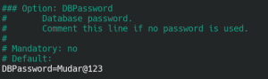](images/Captura-de-imagem_20241025_125046.png)Agora vamos configurar as permissões no script de inicialização do Zabbix Server.

```
# chmod +x /etc/rc.d/rc.zabbix_server
```

Agora podemos iniciar o serviço do Zabbix Server.

```
# /etc/rc.d/rc.zabbix_server start
```

[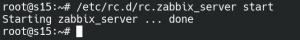](images/Captura-de-imagem_20241025_125851.png)Podemos verificar se o zabbix iniciou corretamente no arquivo de logs.

```
# cat /var/log/zabbix/zabbix_server.log
```

[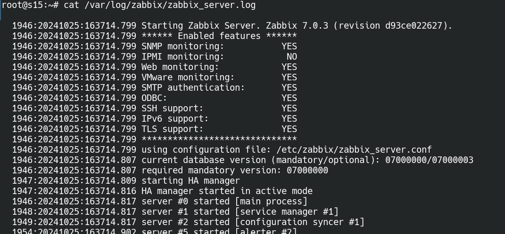](images/Captura-de-imagem_20241025_133743.png)

Ou até mesmo executando o comando ps e filtrando por zabbix.

```
# ps aux | grep zabbix
```

Como podemos ver na saída dos logs o zabbix iniciou corretamente.

Para o Zabbix Server iniciar junto com o sistema operacional, precisamos configurar a seguinte entrada no arquivo **/etc/rc.d/rc.local**.

```
# Zabbix Server
if [ -x /etc/rc.d/rc.zabbix_server ]; then
  /etc/rc.d/rc.zabbix_server start
fi

```

Já para ele parar da maneira correta quando o sistema operacional for imterrompido, precisamos da seguinte entrada no arquivo **/etc/rc.d/rc.local\_shutdown**.

```
# Zabbix Server
if [ -x /etc/rc.d/rc.zabbix_server ]; then
  /etc/rc.d/rc.zabbix_server stop
fi

```

## Configuração do Frontend

Agora vamos configurar o PHP e o Apache para podermos usar o forntend do zabbix através do navegador.

O **Slackware 15** por padrão utiliza o **PHP 7.4.x**, está versão não é suportada pelo Zabbix 7, porém, podemos fazer a instalação das versões **8.0.x** ou **8.1.x** utilizando o próprio slackpkg, já que os pacotes estão no diretório extra do Slackware.

Digite o seguinte comando para buscar os pacotes disponíveis do PHP.

```
# slackpkg search php
```

[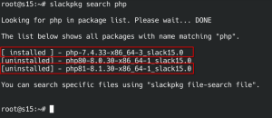](images/Captura-de-imagem_20241025_154721.png)Agora que sabemos qual versão queremos instalar, vamos executar o seguinte comando para fazer a instalação.

```
# slackpkg install php81
```

Agora remova o **PHP 7** com o seguinte comando.

```
# slackpkg remove php-7
```

Agora que atualizamos a versão do PHP, precisamos editar alguns paramentros no **php.ini** para a execução do frontend web do zabbix, execute os seguintes comandos.

```
# sed -i "s/post_max_size = 8M/post_max_size = 16M/" /etc/php.ini

# sed -i "s/max_execution_time = 30/max_execution_time = 300/" /etc/php.ini

# sed -i "s/max_input_time = 60/max_input_time = 300/" /etc/php.ini
```

Agora vamos habilitar o PHP no Apache, por padrão o PHP não vem habilitado, execute os seguintes comandos.

```
# sed -i "s/DirectoryIndex index\.html/DirectoryIndex index.php index.html/" /etc/httpd/httpd.conf

# sed -i "s/#Include \/etc\/httpd\/mod_php\.conf/Include \/etc\/httpd\/mod_php.conf/" /etc/httpd/httpd.conf
```

Vamos criar um link simbólico do diretório de instalação do zabbix frontend para o htdocs do apache, execute o seguinte comando.

```
# ln -s /usr/share/zabbix /var/www/htdocs/
```

Execute o seguinte comando para configurar as permissões do script de inicialização do apache.

```
# chmod +x /etc/rc.d/rc.httpd
```

Agora podemos iniciar o serviço.

```
# /etc/rc.d/rc.httpd start
```

Agora basta abrir a interface web e concluirmos a configuração, observe que o caminho é o endereço ip do servidor **/zabbix**, clique em **Next step**.

[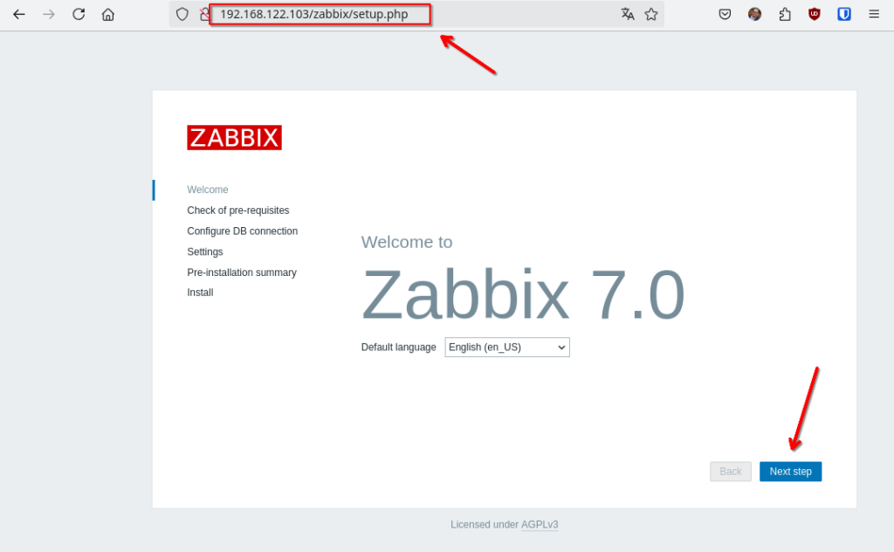](images/Captura-de-imagem_20241025_163024.png)

Verifique se todos os pré-requisitos foram atendidos e cliquem e **Next step**.

[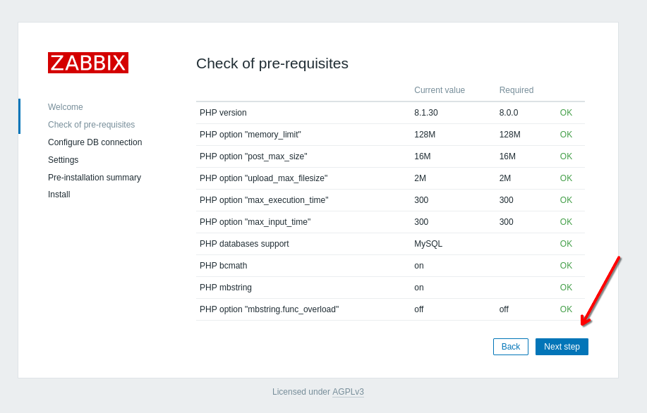](images/Captura-de-imagem_20241025_163211.png)

Informe as configurações de conexão com o banco de dados, se você configurou tudo como localhost, basta digitar a senha de conexão com o banco.

[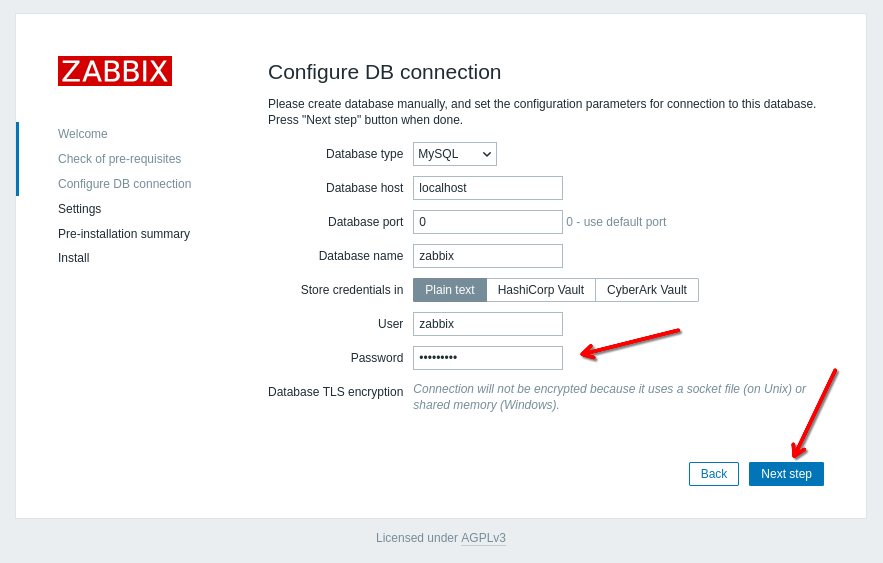](images/Captura-de-imagem_20241025_163345.png)

Defina o nome do servidor, o timezone e o tema e clique en **Next step**.

[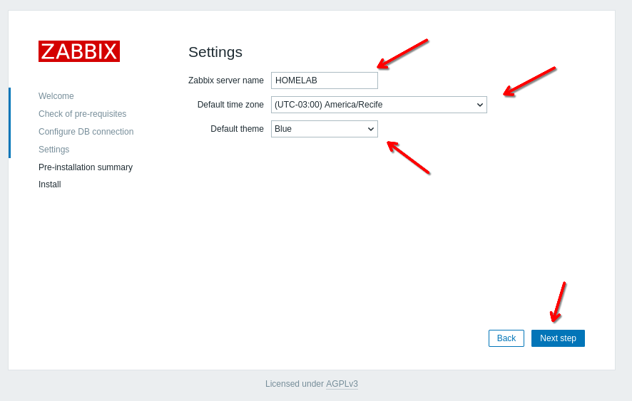](images/Captura-de-imagem_20241025_163812.png)

Verifique as configurações e clique em Next step.

[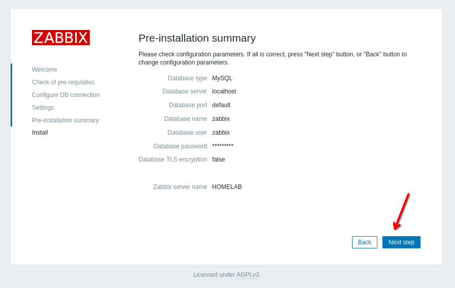](images/Captura-de-imagem_20241025_163949.png)

Por padrão na próxima tela você receberá um erro, informando que você não pode gravar o arquivo zabbix.conf.php, existem duas possibilidades de contornar esse problema.

A primeira é baixando o arquivo de configuração para sua máquina e posteriormente enviar para o servidor no diretório **/var/www/htdocs/zabbix/conf**.

A segunda é mudar as permissões do diretório temporariamente, que é o que vamos fazer, execute o comando abaixo.

```
# chmod 775 /var/www/htdocs/zabbix/conf
```

Agora só clicar em **Finish**.

[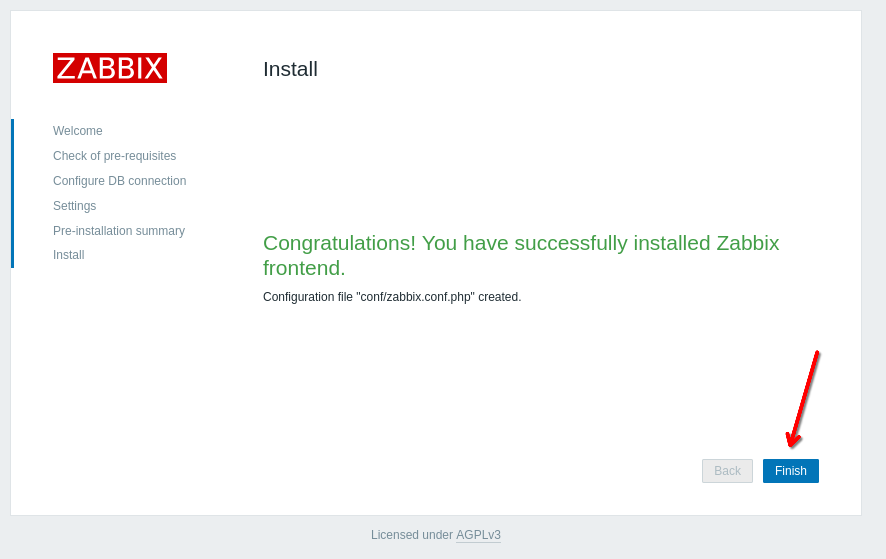](images/Captura-de-imagem_20241025_165253.png)Volte as permissões ao padrão.

```
# chmod 755 /var/www/htdocs/zabbix/conf
```

Agora só entrar no Zabbix.

[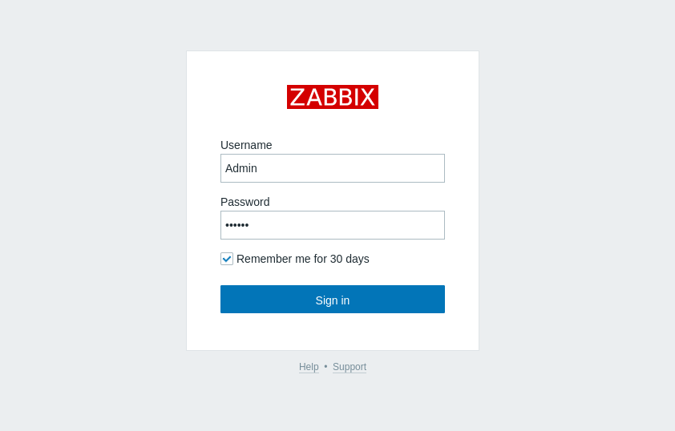](images/Captura-de-imagem_20241025_165755.png)Usuário e senha padrão são:

```
Usuário - Admin
Senha - zabbix
```

[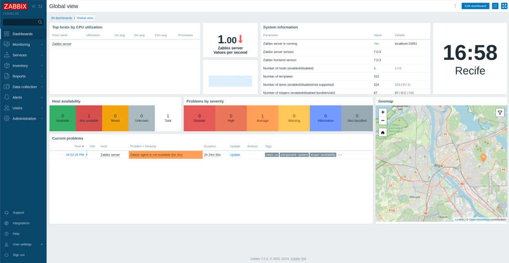](images/Captura-de-imagem_20241025_165904.png)

## Configuração do Zabbix Agent

Se você observou bem a figura acima, reparau que o zabbix agent não está em execução, ele já vem configurado por padrão para quando o zabbix server está executando no mesmo servidor, porém o zabbix agent 2 tem plugins disponíveis em outras distribuições e que ainda não foram portados para o Slackware, dessa forma é necessário comentar a linha que faz referência as configurações do plugin, essa linha está no final do arquivo **/etc/zabbix/zabbix\_agent2.conf**.

[](images/Captura-de-imagem_20241025_171427.png)Agora basta configurarmos as permissões e iniciar o serviço, execute os seguintes comandos.

```
# chmod +x /etc/rc.d/rc.zabbix_agent2

# /etc/rc.d/rc.zabbix_agent2 start
```

Um detalhe importante é que você pode baixar tanto o **zabbix agent** quanto o **zabbix agent 2** no meu repositório.

Caso tenha baixado zabbix agent, o arquivo de configuração é o **/etc/zabbix/zabbix\_agentd.conf**, não teremos a opção dos plugins no arquivo de configuração, e os  comandos serão esses:

```
# chmod +x /etc/rc.d/rc.zabbix_agentd

# /etc/rc.d/rc.zabbix_agentd start
```

Assim como no Zabbix Server, para o Zabbix Agent iniciar junto com o sistema operacional, precisamos configurar a seguinte entrada no arquivo **/etc/rc.d/rc.local**.

```
# Zabbix Agent 2
if [ -x /etc/rc.d/rc.zabbix_agent2 ]; then
  /etc/rc.d/rc.zabbix_agent2 start
fi

```

Já para ele parar da maneira correta quando o sistema operacional for imterrompido, precisamos da seguinte entrada no arquivo **/etc/rc.d/rc.local\_shutdown**.

```
# Zabbix Agent 2
if [ -x /etc/rc.d/rc.zabbix_agent2 ]; then
  /etc/rc.d/rc.zabbix_agent2 stop
fi

```

Depois disso teremos nosso Zabbix instalado e configurado.

[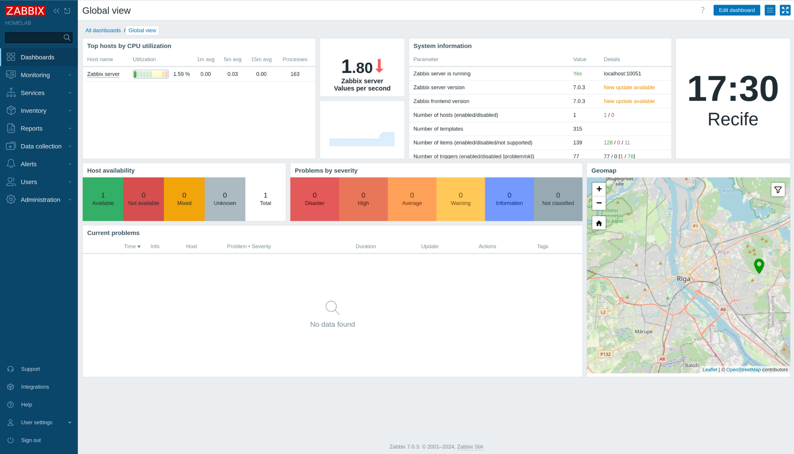](images/Captura-de-imagem_20241025_173036.png)

Até o próximo post!

:D
